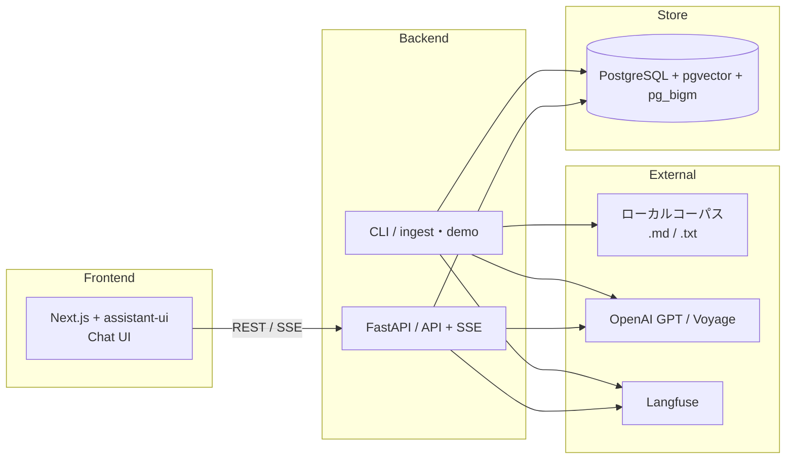

# Private RAG Apps

**このリポジトリが示すもの**: 「動く RAG」を作ることではなく、プロダクション GenAI で難しい 4 点 — **Eval（品質評価）・可観測性・クリーンな境界・信頼性** — に向き合った設計・実装の**判断の痕跡**を示すことです。レビュアーが見るべきは成果物そのものより、なぜその設計にしたかという判断の跡です（→ [docs/decisions.md](docs/decisions.md)）。

ローカルのプライベートドキュメントコーパス（Markdown / テキスト）を取り込み、ハイブリッド検索（pgvector + pg_bigm）+ リランクで**出典付き**回答を返す、単一ユーザー向け RAG チャットアプリケーションです。

- **Eval**: 検索指標（Recall@5/10・nDCG@10・MRR）と生成指標（Faithfulness・Answer Relevance）を計測し、変更前後のスコア推移を記録（→ [docs/eval_report.md](docs/eval_report.md)）
- **可観測性**: すべての LLM/埋め込み/リランク呼び出しを Langfuse トレースに記録（未設定でも no-op で動作）（→ [docs/observability.md](docs/observability.md)）
- **クリーンな境界**: `api → generation`/`retrieval`、`ingestion`/`retrieval` 分離など、レイヤ間の依存方向を明文化し監査（→ [AGENTS.md](AGENTS.md) §3）
- **信頼性**: コンテキスト外の主張をさせない・答えが無ければ「見つからない」を返す・出典を必ず付ける

## デモ

<!-- TODO(M5 Phase 5b): デモGIF（seedコーパスへの質問→ストリーミング回答→出典カード）を docs/assets/demo.gif に追加し、ここに掲載する -->

準備中です（Docker 環境での実機撮影待ち）。動作の様子は下記クイックスタートで実際に確認できます。

## クイックスタート（デモモード）

クリーンな環境（`git clone` 直後）から 15 分以内にチャットできる状態を目指しています。必須の外部キーは **OpenAI** と **Voyage** のみです（Langfuse は任意 — 未設定でも計装が no-op になり、アプリ・デモ・eval は問題なく動作します）。

1. `cp backend/.env.example backend/.env` して `OPENAI_API_KEY` / `VOYAGE_API_KEY` と、`LLM_MODEL` / `CONDENSE_MODEL` / `JUDGE_MODEL` / `EMBED_MODEL`（例: `voyage-4-lite`）のモデル名を設定
2. `make setup`（uv sync / pnpm install / `.env` 生成（既にあれば何もしない）/ PostgreSQL(pgvector+pg_bigm) コンテナ起動）
3. `make demo`（マイグレーション適用 → seed コーパス（`seed/corpus/`）を取り込み。2回目以降は無変更ファイルをスキップするため高速）
4. 別ターミナルで `make api`（FastAPI起動、`http://localhost:8000`）
5. 別ターミナルで `make web`（Next.js起動、`http://localhost:3000` でチャット画面）

`GET http://localhost:8000/health` または `POST http://localhost:8000/api/chat` で疎通確認が可能です。データ管理画面（ソース一覧・再取り込み・インデックス初期化）は `http://localhost:3000/sources` から利用できます。

### 自分の文書を取り込みたい場合

`make demo` は常に `seed/corpus` を取り込み対象にします（`.env` の `CORPUS_DIR` を上書きしても影響を受けません）。自分の文書を試したい場合は次の手順で切り替えてください。

1. データ管理画面またはAPI（`DELETE /api/index`）でインデックスを初期化する（seedとの混在を避けるため）
2. `backend/.env` の `CORPUS_DIR` を自分の文書ディレクトリに変更する
3. `make ingest`（`trigger=cli` で増分取り込み。`FORCE_DELETE=1` を付けると削除安全弁をバイパスできる）

## アーキテクチャ

2 プロセス + 1 ミドルウェアの最小構成（詳細: [docs/architecture.md](docs/architecture.md)、Ingestion Path / Query Path の詳細フローは同ドキュメント §3）。



## 技術スタックと根拠

| 領域 | 採用 | 一言根拠 |
|---|---|---|
| Backend | Python 3.13 / FastAPI / uvicorn | async・SSE ストリーミングが素直 |
| Store | PostgreSQL + pgvector + pg_bigm | ベクトル・全文・リレーショナルを1DBに集約し運用を軽く保つ |
| AI | OpenAI GPT（生成）/ Voyage voyage-4-lite・rerank-2.5（埋め込み・リランク） | 低コスト・低レイテンシ重視。同ベンダの埋め込み+リランクで完結 |
| Observability | Langfuse | LLM トレース + コスト集計を一元化。未設定でも no-op |
| Frontend | Next.js (App Router) + assistant-ui | streaming/auto-scroll/retry を自前実装しない |
| 取り込み | CLI（`make ingest`/`make demo`）+ BackgroundTasks | ローカルコーパスのMVPにジョブキューは過剰 |

詳細な選定根拠は [docs/requirements.md §7](docs/requirements.md#7-技術選定決定と根拠)、個々の設計判断（代替案との比較を含む）は [docs/decisions.md](docs/decisions.md) を参照してください。

## 設計文書・品質・可観測性

- [docs/decisions.md](docs/decisions.md) — 設計判断の索引（なぜその設計か。代替案・根拠）
- [docs/eval_report.md](docs/eval_report.md) — Eval レポート（検索・生成品質のスコア推移。★ショーケースの核）
- [docs/observability.md](docs/observability.md) — Langfuse トレースの説明とスクリーンショット
- [docs/requirements.md](docs/requirements.md) / [docs/architecture.md](docs/architecture.md) / [docs/db_design.md](docs/db_design.md) — 要件・構成・物理設計
- [docs/specs/](docs/specs/) — マイルストーンごとのフィーチャースペック（M0〜M5）
- [AGENTS.md](AGENTS.md) — コーディングエージェント向けの作業規約・依存方向ルール

## スコープについて

SaaS コネクタ（Notion/Slack/Drive）・OAuth・マルチユーザー・ACL・エージェンティック RAG・PDF パースは v1 では**意図的に外して**います。単一ユーザー・ローカルコーパスに絞ることで、Eval・可観測性・クリーンな境界という技術ショーケースの核に集中するためです。詳細: [docs/requirements.md §11](docs/requirements.md#11-将来拡張)。

## OpenAPI仕様書の生成

```bash
make openapi
```

`backend/openapi.json` にOpenAPI仕様書が出力されます。
