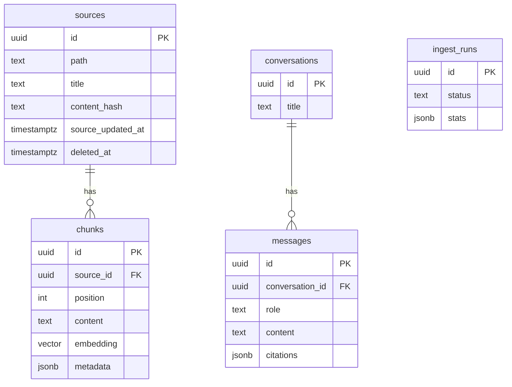

# Private RAG Apps — DB設計 (db_design.md)

> PostgreSQL + pgvector の物理設計。`architecture.md` (v0.2) のデータフローと `requirements.md` §8 のエンティティを実装レベルに落とす。
> DDL は説明用の正準形。実際の適用は Alembic マイグレーションで行う（§8）。

---

## 1. 方針

- **単一 DB 集約**: リレーショナル / ベクトル / 全文をすべて PostgreSQL に持つ。運用対象を Postgres 1 つに絞る。
- **論理削除**: コーパスから消えたファイルは `deleted_at` で表現し、検索は `deleted_at IS NULL` で絞る。
- **UUID 主キー**: URL 露出耐性とマージしやすさのため `uuid`（`gen_random_uuid()`）。
- **監査列**: 主要テーブルに `created_at` / `updated_at`。

---

## 2. 拡張（extensions）と★日本語全文検索の選択

```sql
CREATE EXTENSION IF NOT EXISTS "pgcrypto";   -- gen_random_uuid()
CREATE EXTENSION IF NOT EXISTS "vector";     -- pgvector
CREATE EXTENSION IF NOT EXISTS "pg_bigm";    -- 日本語対応の全文検索(bigram)
```

### ★決定済み: 全文検索エンジン = pg_bigm

Postgres 標準 FTS（`to_tsvector`）は日本語の分かち書きができないため使わない。**pg_bigm**（bigram・拡張 1 つで軽量）を採用（MVP は動かすこと優先の決定による）。

| 選択肢 | 特徴 | 位置づけ |
|---|---|---|
| **pg_bigm**（採用） | bigram。拡張 1 つで軽量。類似度スコアあり | v1 |
| PGroonga | Groonga エンジン。日本語検索が強力・スコアリング良好 | 検索品質を上げたくなったら差し替え候補 |

差し替え時の影響は「この拡張定義」「`retrieval` の全文検索クエリ（§5）」「chunks の全文インデックス（§4）」に局所化される。

---

## 3. ER 概要



> v0.1 の `connections`（SaaS 接続・OAuth トークン）と `sync_runs` は廃止。`documents` は `sources` に改名（ローカルファイル前提の命名へ）。`ingest_runs` は特定接続に紐づかない実行ログとして独立。

---

## 4. テーブル定義（DDL）

### sources — 取り込み元ドキュメント（ローカルファイル）

```sql
CREATE TABLE sources (
    id                 uuid PRIMARY KEY DEFAULT gen_random_uuid(),
    path               text NOT NULL,      -- コーパスディレクトリからの相対パス
    title              text NOT NULL DEFAULT '',
    content_hash       text NOT NULL,      -- 変更検知用（無変更なら再埋め込みしない）
    source_updated_at  timestamptz,        -- ファイルの mtime
    deleted_at         timestamptz,        -- コーパスから消えたファイルの論理削除
    created_at         timestamptz NOT NULL DEFAULT now(),
    updated_at         timestamptz NOT NULL DEFAULT now(),
    UNIQUE (path)
);
```

### chunks — 検索単位（ベクトル + 全文）

```sql
-- embedding 次元は埋め込みモデル依存。voyage-4-lite = 1024（デフォルト。256/512/2048 も選択可）。
CREATE TABLE chunks (
    id           uuid PRIMARY KEY DEFAULT gen_random_uuid(),
    source_id    uuid NOT NULL REFERENCES sources(id) ON DELETE CASCADE,
    position     int  NOT NULL,           -- ドキュメント内の並び順
    content      text NOT NULL,
    embedding    vector(1024) NOT NULL,
    metadata     jsonb NOT NULL DEFAULT '{}',  -- 見出しパス等
    created_at   timestamptz NOT NULL DEFAULT now(),
    UNIQUE (source_id, position)
);
```

### conversations / messages — チャット

```sql
CREATE TABLE conversations (
    id         uuid PRIMARY KEY DEFAULT gen_random_uuid(),
    title      text NOT NULL DEFAULT '',
    created_at timestamptz NOT NULL DEFAULT now(),
    updated_at timestamptz NOT NULL DEFAULT now()
);

CREATE TABLE messages (
    id              uuid PRIMARY KEY DEFAULT gen_random_uuid(),
    conversation_id uuid NOT NULL REFERENCES conversations(id) ON DELETE CASCADE,
    role            text NOT NULL CHECK (role IN ('user','assistant')),
    content         text NOT NULL,
    citations       jsonb,               -- assistant のみ。出典配列（architecture.md §5）
    created_at      timestamptz NOT NULL DEFAULT now()
);
```

### ingest_runs — 取り込み実行ログ

```sql
CREATE TABLE ingest_runs (
    id          uuid PRIMARY KEY DEFAULT gen_random_uuid(),
    trigger     text NOT NULL CHECK (trigger IN ('cli','api','demo')),
    status      text NOT NULL CHECK (status IN ('running','success','error')),
    stats       jsonb NOT NULL DEFAULT '{}',  -- {added, updated, deleted, skipped, failed_files: []}
    error       text,
    started_at  timestamptz NOT NULL DEFAULT now(),
    finished_at timestamptz
);
```

> 多重実行の抑止（architecture §6）は `status='running'` の行の存在チェックで行う。

---

## 5. インデックス設計

```sql
-- ベクトル検索: HNSW（更新のあるデータで再現率/速度のバランスが良い）
CREATE INDEX chunks_embedding_hnsw
    ON chunks USING hnsw (embedding vector_cosine_ops)
    WITH (m = 16, ef_construction = 64);

-- 全文検索(pg_bigm): 本文の bigram GIN
CREATE INDEX chunks_content_bigm
    ON chunks USING gin (content gin_bigm_ops);

-- 絞り込み・結合の補助
CREATE INDEX chunks_source_id       ON chunks (source_id);
CREATE INDEX sources_not_deleted    ON sources (updated_at) WHERE deleted_at IS NULL;
CREATE INDEX messages_conversation  ON messages (conversation_id, created_at);
CREATE INDEX ingest_runs_started    ON ingest_runs (started_at DESC);
```

- **HNSW vs IVFFlat**: 取り込みは増分で継続的に更新されるため、事前学習不要でリコールの高い **HNSW** を採用。検索時は `hnsw.ef_search` を調整。
- 検索は `deleted_at IS NULL` 前提なので、`sources` に部分インデックスを置き chunks 側は結合で除外する。

---

## 6. ハイブリッド検索クエリ（RRF 融合の例）

`retrieval` が発行する SQL の骨子（pg_bigm 版）。パラメータ: `:q_embedding`, `:q_text`, `:cand_k`（各50）, `:rrf_k`（60）, `:fuse_k`（40）。

```sql
WITH vector_search AS (
    SELECT c.id,
           ROW_NUMBER() OVER (ORDER BY c.embedding <=> :q_embedding) AS rank
    FROM chunks c
    JOIN sources s ON s.id = c.source_id AND s.deleted_at IS NULL
    ORDER BY c.embedding <=> :q_embedding
    LIMIT :cand_k
),
fts_search AS (
    SELECT c.id,
           ROW_NUMBER() OVER (ORDER BY bigm_similarity(c.content, :q_text) DESC) AS rank
    FROM chunks c
    JOIN sources s ON s.id = c.source_id AND s.deleted_at IS NULL
    WHERE c.content =% :q_text            -- pg_bigm 類似演算子（GIN 使用）
    LIMIT :cand_k
),
fused AS (
    SELECT id, 1.0 / (:rrf_k + rank) AS score FROM vector_search
    UNION ALL
    SELECT id, 1.0 / (:rrf_k + rank) AS score FROM fts_search
)
SELECT id, SUM(score) AS rrf_score
FROM fused
GROUP BY id
ORDER BY rrf_score DESC
LIMIT :fuse_k;
```

- 返った `fuse_k` 件の本文を取得 → **Voyage rerank-2.5** で並べ替え → 最終 `top_k = 8` を生成へ。
- PGroonga に替える場合、`fts_search` の `WHERE`/`ORDER BY` を PGroonga 演算子（`&@~` と `pgroonga_score`）に置換するだけ。

---

## 7. 増分再取り込みを支えるカラム

| 目的 | 使うカラム |
|---|---|
| 無変更スキップ（再埋め込み回避） | `sources.content_hash` |
| 更新検知の補助 | `sources.source_updated_at`（mtime） |
| 削除反映 | `sources.deleted_at`（chunks は検索時に JOIN で除外） |
| 実行の観測 | `ingest_runs.stats`（added/updated/deleted/skipped/failed_files） |

> ドキュメント更新時は「該当 source の chunks を全削除 → 再チャンク → 再挿入」で置換する（決定済み。部分更新より整合を保ちやすい）。

---

## 8. マイグレーション方針（Alembic）

- **0001_init**: 拡張作成（§2）→ 全テーブル（§4）→ インデックス（§5）
- 埋め込み次元・チャンキング・全文エンジンの変更は**破壊的**。マイグレーションに加えて**再インデックス**（chunks 再生成）と `make eval` が必要（AGENTS.md §7）。
- `vector(N)` の N を変える場合は列型変更 + 全再埋め込みになる点に注意。

---

## 9. データ量とインデックスの見積り（初期想定）

- 個人のドキュメントコーパスを想定し、chunks は数万〜数十万オーダーを初期上限に見積もる。
- この規模なら HNSW + pg_bigm GIN で単一 Postgres インスタンスで十分。将来的に桁が上がる場合のみ外部ベクトル DB を検討（architecture.md §11）。

---

## 変更履歴

| version | 日付 | 変更 |
|---|---|---|
| v0.2 | 2026-07-07 | requirements v0.2 追従: `connections`（OAuth トークン暗号化含む）・`sync_runs` を廃止。`documents` → `sources` に改名（path 一意・mtime 保持）、`ingest_runs` を独立ログとして新設（trigger 列追加）。ER 図・インデックス・ハイブリッド検索 SQL を sources 前提に更新。トークン暗号化セクションを削除 |
| v0.1 | 2026-07-04 | 初版（壁打ちドラフト） |