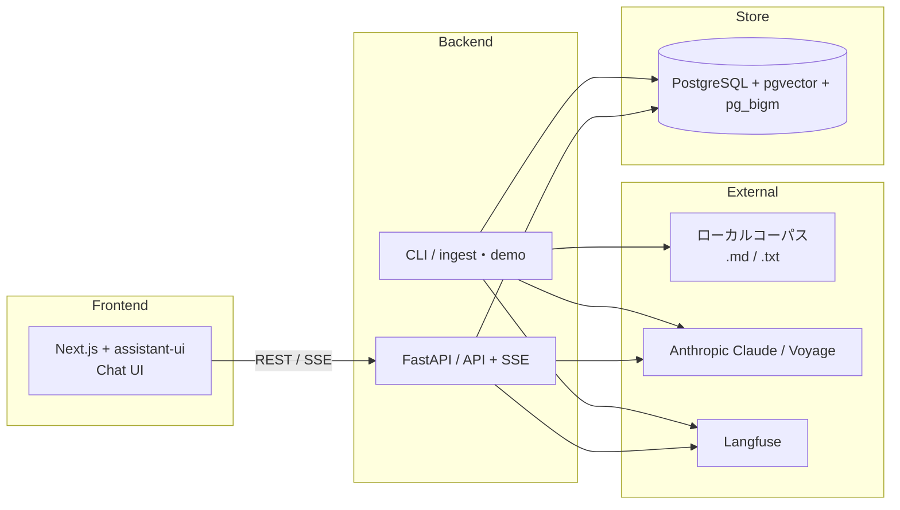
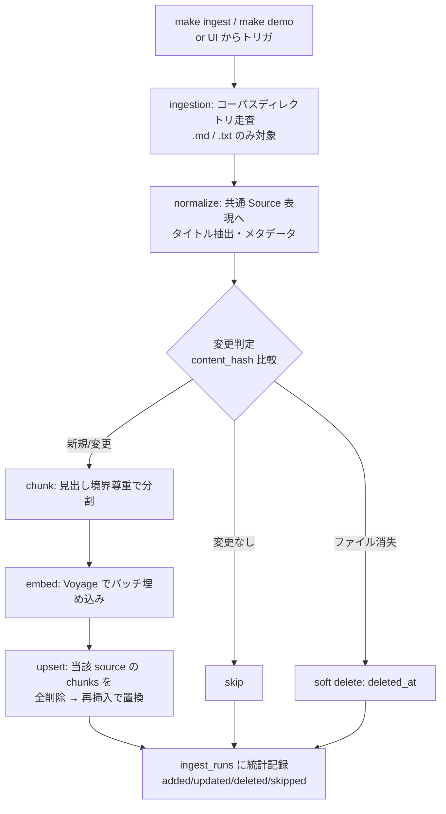
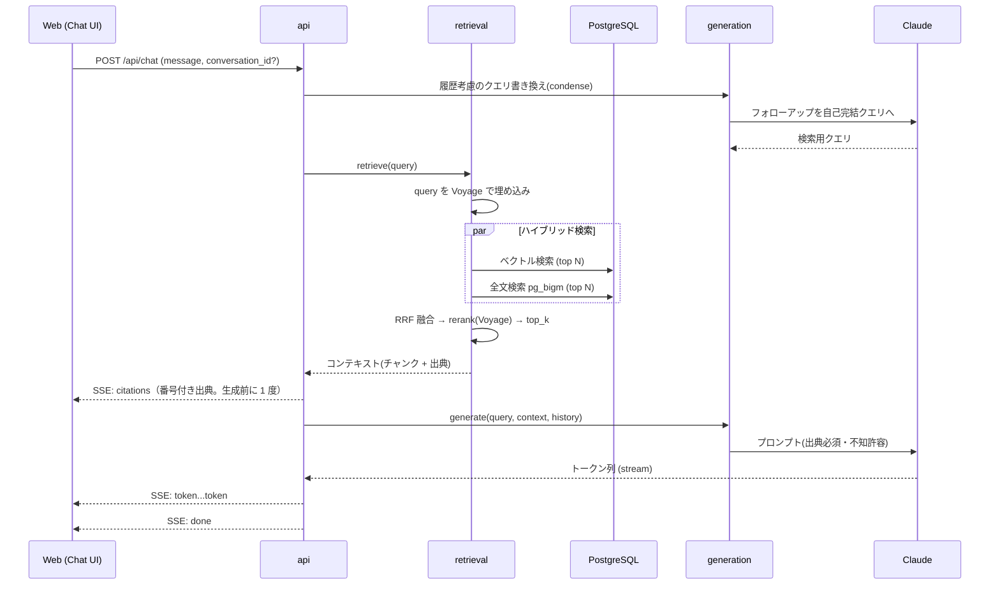

# Private RAG Apps — アーキテクチャ設計 (architecture.md)

> requirements.md (v0.4) を「実装できる粒度」まで具体化する設計文書です。
> DB の詳細（DDL・インデックス）は `db_design.md`、各機能の受け入れ条件は `docs/specs/` に分離します。
> パラメータの数値は**チューニング前提のデフォルト値**です（設定で変更可能にする）。

---

## 1. システム全体構成

2 プロセス + 1 ミドルウェアの最小構成。



- **api**: チャット（検索＋生成）、会話管理、ソース一覧・再取り込みトリガ
- **cli**: コーパス取り込み（`make ingest` / `make demo`）。api と同一コードベース（`ingestion` モジュール）を CLI エントリポイントから呼ぶ
- **pg**: リレーショナル + ベクトル + 全文を単一 DB で
- Redis / ジョブキューは持たない（v0.2 で SaaS 同期がスコープ外になったため。将来 SaaS コネクタ導入時に ARQ を再検討）

### UI からの再取り込み（FR-8）

単一ユーザー前提のため、UI からの再取り込みトリガは **FastAPI の BackgroundTasks（プロセス内非同期実行）** で行う。ジョブキューは導入しない。実行状態は `ingest_runs` テーブルで参照する。

---

## 2. モジュール責務と依存方向

`backend/src/private_rag_apps/` 配下。依存は上から下への一方向（AGENTS.md §3 と一致）。

| モジュール | 責務 | 外部呼び出し |
|---|---|---|
| `api` | HTTP ルート・SSE・リクエスト検証・取り込みの BackgroundTasks 起動 | — |
| `cli` | `ingest` / `demo` コマンド（ingestion を呼ぶ薄い層） | — |
| `generation` | プロンプト組立・LLM 生成・引用付与・クエリ書き換え | **Claude** |
| `retrieval` | ハイブリッド検索・RRF 融合・リランク | **Voyage(embed/rerank)** |
| `ingestion` | コーパス読み込み・正規化・チャンキング・埋め込み・upsert | **Voyage(embed)**, ローカル FS |
| `models` | SQLAlchemy / Pydantic モデル | — |
| `prompts` | プロンプトテンプレート集約 | — |
| `core` | 設定・DB セッション・テレメトリ（全レイヤ共有） | **Langfuse** |

**呼び出しの局所化ルール**（守ること）:
- LLM 呼び出しは `generation` のみ
- 埋め込み呼び出しは `ingestion`（索引時）と `retrieval`（クエリ時）のみ
- リランク呼び出しは `retrieval` のみ
- ローカル FS（コーパス）へのアクセスは `ingestion` のみ

---

## 3. 主要データフロー

### 3.1 Ingestion Path（取り込み: CLI / BackgroundTasks）



- **増分再取り込み**: `sources.content_hash` を比較し、無変更ファイルの再埋め込みをスキップ（コスト削減）
- **更新の置換戦略**: 変更があった source は chunks を全削除→再チャンク→再挿入（部分更新はしない。単純さと整合性を優先）
- **削除反映**: ディレクトリから消えたファイルは `deleted_at` を立て、検索対象から除外
- **デモモード**: `make demo` = シードコーパスを対象に ingest → 完了後すぐチャット可能

### 3.2 Query Path（チャット・同期 + ストリーミング）



> M0〜M1 は非ストリーム（通常 JSON レスポンス）でよい。SSE は M2 で導入（requirements §10）。

---

## 4. 検索設計（Retrieval）

一次検索 → 融合 → リランク の 3 段。デフォルト値は設定化する。

| 段 | 手法 | デフォルト |
|---|---|---|
| ベクトル検索 | cosine 距離（pgvector `<=>`） | 候補 50 件 |
| 全文検索 | pg_bigm 類似（日本語対応） | 候補 50 件 |
| 融合 | Reciprocal Rank Fusion | `k = 60`、融合上位 40 件 |
| リランク | Voyage rerank-2.5 | 40 件 → 最終 **top_k = 8** |

- 最終 top_k の合計トークンが上限を超える場合は末尾を落とす
- ベクトル/全文どちらか 0 件でも動作する（片側だけで融合）
- 検索結果 0 件のときは生成をスキップし「見つからない」を返す（NFR-6）

- **評価/診断モード（M3）**: `evals/` 向けに、RRF 融合直後のランキングとリランク後のランキングの**両方**を返すインターフェースを持つ（リランク寄与の計測用。evals 側で検索ロジックを再実装しない。`docs/specs/m3_eval_expansion.md` §4.2）

> pg_bigm を PGroonga に差し替える場合、影響範囲は `retrieval` の全文検索クエリと DB 拡張のみ（`db_design.md` §2）。

---

## 5. 生成設計（Generation）

### プロンプト構成

- **system**: 役割 / 制約（①取得コンテキストのみに基づく ②各主張に出典番号 `[n]` を付す ③コンテキストに無ければ「見つからない」と答える ④日本語で回答）
- **context**: リランク後のチャンクを `[n] 出典タイトル\n本文` 形式で列挙
- **user**: （書き換え後の）ユーザー質問
- **history**: 直近の会話（トークン予算内で切り詰め）

### 引用（Citation）

回答本文中の `[n]` と、構造化した citations 配列を対応させて返す。

```json
{
  "content": "…という設計です[1]。取り込みは増分で行います[2]。",
  "citations": [
    {"n": 1, "title": "設計メモ", "path": "corpus/design.md", "heading": "検索設計", "chunk_id": "…"},
    {"n": 2, "title": "運用ノート", "path": "corpus/ops.md", "heading": "同期", "chunk_id": "…"}
  ]
}
```

### フォローアップのクエリ書き換え（condense）

「それの詳細は?」のような指示語を、会話履歴を使って自己完結クエリへ変換してから検索する。書き換えは軽量・低コストなモデル呼び出しで行う。

---

## 6. 取り込み設計（Ingestion）

### ローダー

- 対象: 設定されたコーパスディレクトリ配下の `.md` / `.txt`（再帰）
- 対応形式外・読込不能ファイルはスキップし、理由をログと `ingest_runs.stats` に残す
- タイトル抽出: Markdown は先頭 H1、なければファイル名

### チャンキング（デフォルト）

- 目安 **512 トークン / オーバーラップ約 15%**、**見出し境界を尊重**
- Markdown: 見出しセクション単位 → サイズ調整（大きすぎれば分割、小さすぎれば結合）
- プレーンテキスト: 段落単位 → サイズ調整
- チャンクには `metadata`（見出しパス等）を保持し、リランク・引用表示に活用

### 実行形態

- CLI（`make ingest CORPUS=path/`, `make demo`）と、API からの BackgroundTasks 実行の 2 経路。実体は同一の `ingestion` サービス
- 1 実行を `ingest_runs` に記録（added/updated/deleted/skipped の統計）
- 多重実行の抑止: 実行中の `ingest_runs`（status='running'）があれば新規実行を拒否する

---

## 7. API 設計

| メソッド | パス | 用途 |
|---|---|---|
| POST | `/api/chat` | チャット（M2 以降 **SSE ストリーム**。M0〜M1 は JSON）。body: `{conversation_id?, message}` |
| POST | `/api/conversations` | 会話作成（assistant-ui `initialize()` 対応。M2） |
| GET | `/api/conversations` | 会話一覧 |
| GET | `/api/conversations/{id}` | 会話詳細（履歴） |
| GET | `/api/sources` | 取り込み済みソース一覧（パス・タイトル・チャンク数・取り込み日時） |
| POST | `/api/ingest` | 再取り込みトリガ（BackgroundTasks で実行、`ingest_run` の id を返す） |
| GET | `/api/ingest/runs` | 取り込み実行履歴・進行状態 |
| DELETE | `/api/index` | インデックス初期化（全ソース・チャンク削除） |

### SSE イベント（`/api/chat`, M2〜）

| event | data | 送出タイミング |
|---|---|---|
| `citations` | 番号付き出典配列（§5） | **rerank 完了直後・最初の `token` の前に 1 度**（`[n]`→出典の対応は生成前に確定するため） |
| `token` | `{ "delta": "…" }` 逐次トークン | 生成トークンごと |
| `done` | `{ "message_id": "…", "conversation_id": "…" }` | 正常終了時（user + assistant を一括保存後） |
| `error` | `{ "message": "…" }` | 回復不能な失敗時（そのターンは非保存） |

### フロントエンド連携（assistant-ui カスタムランタイム）

- チャット UI は **assistant-ui**（shadcn/ui + Tailwind ベース）を採用。CLI がコンポーネントを `frontend/` にコピーする方式で、コードは自プロジェクトの資産として持つ。
- Vercel AI SDK のデータストリーム protocol には乗せず、**カスタムランタイム**で上記 SSE を直接受ける（自前 FastAPI SSE と最も相性が良いため）。
- SSE イベント → assistant-ui ランタイムのマッピング:

| SSE event | assistant-ui 側の扱い |
|---|---|
| `token` | 進行中アシスタントメッセージのテキストに逐次追記 |
| `citations` | メッセージのカスタムパート（出典）として保持し、**出典カードを React コンポーネントで描画**（generative UI 的な使い方） |
| `done` | メッセージを確定し `message_id` を紐付け |
| `error` | エラー状態を表示（リトライ導線） |

- 出典カードのクリックで元ソース情報（title / path / heading）を表示（FR-5）。
- **実装注意（累積 yield）**: assistant-ui の `ChatModelAdapter.run` は各ステップで**完全な content を yield する契約**のため、出典パートは**累積 content に一度だけ追加して保持し続ける**（チャンクごとに content を作り直すと出典が消える。`docs/specs/m2_streaming_and_history.md` §5.2）。
- 最終表示は本文に出現した `[n]` のカードのみ。citations に対応の無い**範囲外 `[n]` はリンク化・カード化しない**（同 §4.5/§5.3）。
- auto-scroll・retry・streaming 状態など手作りで壊れやすい部分は assistant-ui の実装に委ね、自前実装しない（NFR-7 保守性）。

---

## 8. 可観測性（Observability）

- **1 チャットリクエスト = 1 Langfuse トレース**。span: `condense` → `embed_query` → `retrieve`（vector/fts）→ `rerank` → `generate`
- 各 LLM/埋め込み/リランク呼び出しでトークン数・コスト・レイテンシを記録
- 取り込み実行も trace 化（埋め込みコストの可視化）
- **Eval 実行**（`make eval`）も trace 化し、judge 含むコストを記録（M3。judge の LLM 呼び出しは `evals/` から行う。AGENTS.md §3）
- `LANGFUSE_*` 未設定時は計装を **no-op** とし動作を妨げない（requirements NFR-4/NFR-8）
- **計装は M0 の骨格段階で配線する**（requirements NFR-4。後付けはトレース漏れを生む）

---

## 9. 設定とシークレット

- `core/config.py`（pydantic-settings）で一元管理。値のハードコード禁止
- 必須キー: `ANTHROPIC_API_KEY` / `VOYAGE_API_KEY` / `DATABASE_URL` / `CORPUS_DIR`（`LANGFUSE_*` は**任意**・未設定時は計装 no-op。§8）

---

## 10. エラー処理・フォールバック

| 事象 | 挙動 |
|---|---|
| 検索 0 件 | 生成せず「該当情報が見つかりません」 |
| LLM 失敗 | リトライ（指数バックオフ）→ 失敗時 `error` イベント |
| 取り込み中の個別ファイル失敗 | 該当ファイルをスキップして続行、`ingest_runs.stats` に記録 |
| 取り込み全体の失敗 | `ingest_runs.status='error'` + error 記録 |
| 埋め込み API 失敗 | バッチ単位でリトライ、失敗バッチは記録してスキップ |

---

## 11. 主要な設計判断（要点）

- **pgvector 単一 DB**: ベクトル + 全文 + リレーショナルを 1 箇所に集約し運用を軽く保つ（Qdrant 比較の上で決定: 日本語ハイブリッド検索が 1 クエリで完結・整合性が FK/トランザクションで済む・NFR-8 の 15 分クイックスタートに寄与）。スケール時に外部ベクトル DB へ切り出す余地は残す。
- **RRF による融合**: スコアスケールの異なるベクトル/全文を順位ベースで安全に統合できる。
- **リランクを最終段に**: 一次検索の再現率を稼ぎ、精度はリランクで担保する定番構成。
- **ジョブキューを持たない**: SaaS 同期がスコープ外のため、取り込みは CLI + プロセス内 BackgroundTasks で足りる。ARQ/Redis は SaaS コネクタ導入時に再検討（requirements §11）。
- **更新は全置換**: source 更新時は chunks を全削除→再生成。部分更新より単純で整合を保ちやすい。
- **チャット UI は assistant-ui**: バックエンド非依存のカスタムランタイムで自前 SSE を直接受けられ、shadcn/ui ベースでコードを資産化できる。streaming/auto-scroll/retry 等の定番 UX を再実装しない。ChatKit は不採用（OpenAI API への密結合・UI スクリプトが OpenAI CDN 依存で、Claude 構成・公開リポジトリに不向き）。

---

## 変更履歴

| version | 日付 | 変更 |
|---|---|---|
| v0.4 | 2026-07-08 | M2/M3 スペック追従 + 全体レビュー反映: §3.2/§7 の SSE を M2 確定版へ（**citations を生成前送出**・`done` に `conversation_id`・エラーターン非保存）。§7 API 表に `POST /api/conversations` 追加、assistant-ui に**累積 yield の注意**と**範囲外 `[n]` 無視**を追記。§4 に `retrieval` の**評価/診断モード**（融合前/後の両ランキング）を追加。§8 に Eval/judge のトレースを追記。`LANGFUSE_*` を任意化（§8/§9）。`web/` → `frontend/`（AGENTS v0.5 追従）。ヘッダの requirements 参照を v0.4 へ |
| v0.3 | 2026-07-07 | チャット UI に **assistant-ui**（カスタムランタイム）を採用。§7 に SSE→ランタイムのマッピングと出典カードの generative UI 描画を追記。§1 構成図・§11 設計判断を更新。ChatKit 不採用の理由を明記 |
| v0.2 | 2026-07-07 | requirements v0.2 追従: SaaS コネクタ・OAuth・connectors モジュール・worker/ARQ/Redis を削除。取り込みを CLI + BackgroundTasks に変更、`cli` モジュール追加。API から OAuth/connections 系を削除し sources/ingest 系に置換。全文検索を pg_bigm と明記。sync_runs → ingest_runs。Qdrant 比較を経た pgvector 採用理由を §11 に追記 |
| v0.1 | 2026-07-04 | 初版（壁打ちドラフト） |