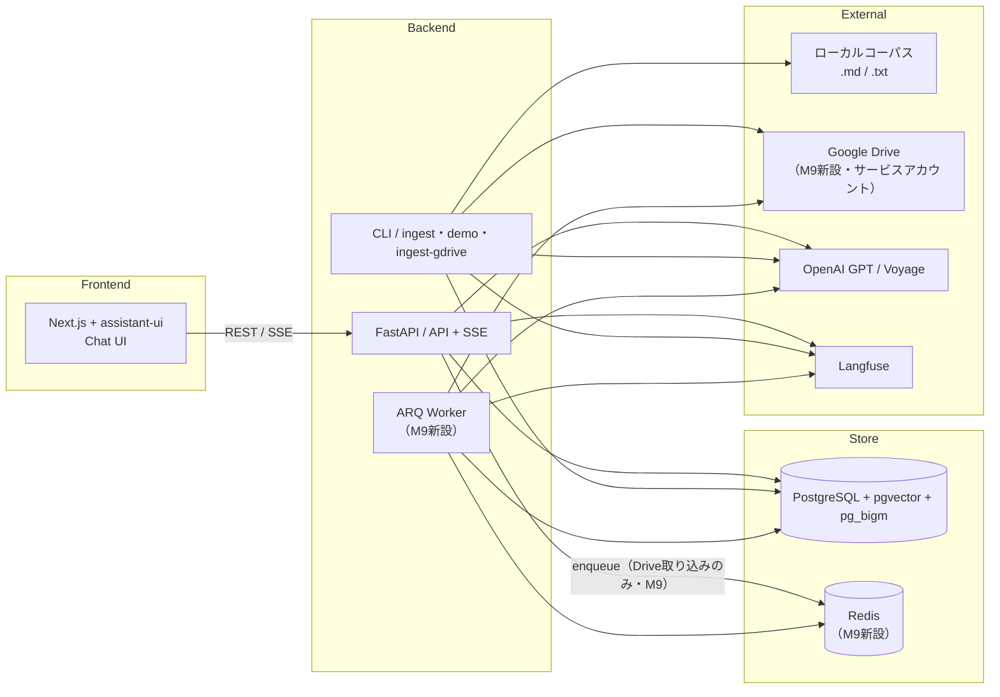
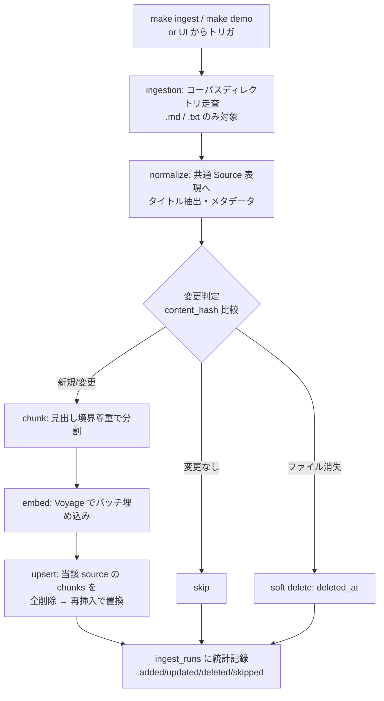
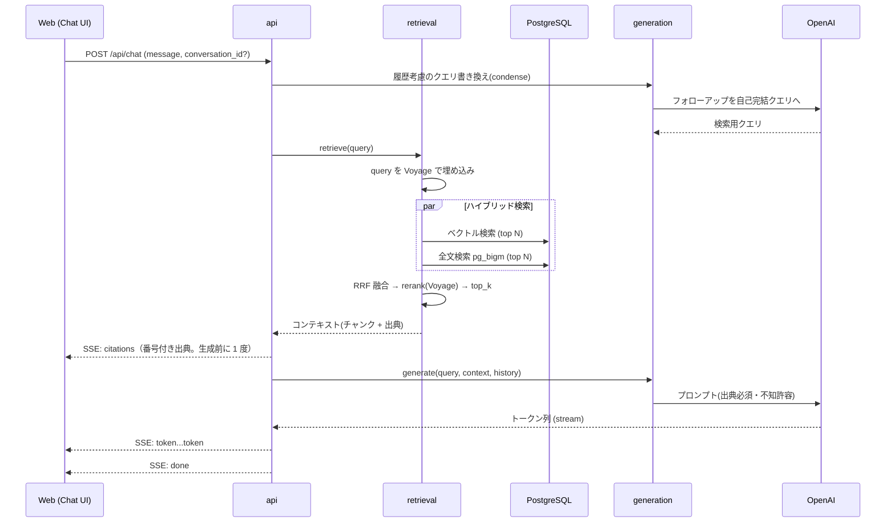

# Private RAG Apps — アーキテクチャ設計 (architecture.md)

> requirements.md (v0.4) を「実装できる粒度」まで具体化する設計文書です。
> DB の詳細（DDL・インデックス）は `db_design.md`、各機能の受け入れ条件は `docs/specs/` に分離します。
> パラメータの数値は**チューニング前提のデフォルト値**です（設定で変更可能にする）。

---

## 1. システム全体構成

2 プロセス + 1 ミドルウェアの最小構成（**ローカル取り込みの範囲では**。M9 で Google Drive 取り込みの API 経由トリガに限り、`worker` プロセスと Redis ミドルウェアが追加される。下記参照）。



- **api**: チャット（検索＋生成）、会話管理、ソース一覧・再取り込みトリガ（ローカル取り込みは引き続き `BackgroundTasks`。Drive 取り込みの API 経由トリガ `POST /api/ingest/gdrive` のみ ARQ へ enqueue する。M9）
- **cli**: コーパス取り込み（`make ingest` / `make demo` / `make ingest-gdrive`）。api と同一コードベース（`ingestion` モジュール）を CLI エントリポイントから呼ぶ。`make ingest-gdrive` は他の CLI コマンドと同じく呼び出しプロセス内で同期実行し、Redis/worker には依存しない（M9）
- **worker**（M9 新設）: ARQ ワーカープロセス。`POST /api/ingest/gdrive` が enqueue したジョブのみを処理する薄い層（`ingestion.execute_gdrive_ingestion()` を呼ぶのみ。AGENTS.md §3）。`make worker` で `api` と同じくコンテナとして起動する（`backend/docker/ingest_worker/Dockerfile.local`。compose上のサービス名は `ingest_worker`。docs/specs/26071710-m9_google_drive_ingestion/spec.md §4.8 v0.6）
- **pg**: リレーショナル + ベクトル + 全文を単一 DB で
- **redis**（M9 新設）: `docker-compose.yml` の `redis` サービス。**Drive 取り込みの API 経由トリガの堅牢化（FastAPI プロセス再起動をまたいだ再試行）にのみ**使う。ローカル取り込み（CLI/API/BackgroundTasks）には一切関与しない
- Redis / ジョブキューは、ローカル取り込みの範囲では持たない（v0.2 で SaaS 同期がスコープ外になったため）。**M9 で Google Drive 取り込みの API 経由トリガに限定した例外として ARQ/Redis を導入した**（AGENTS.md §2、`docs/specs/26071710-m9_google_drive_ingestion/spec.md` §3.3）。将来 SaaS コネクタを本格導入する際は改めて再検討する

### Google Drive からの取り込み（M9）

単一の固定 Drive フォルダをサービスアカウント認証で取り込む、限定スコープの機能（詳細: `docs/specs/26071710-m9_google_drive_ingestion/spec.md`）。`DRIVE_FOLDER_ID`/`DRIVE_SERVICE_ACCOUNT_FILE` が空の場合は完全に無効（`make demo` のクリーンルーム体験・既存のローカル取り込みには一切影響しない）。

- 認証: サービスアカウント（OAuth は使わない）。対象フォルダをサービスアカウントのメールアドレスに共有するだけで動作する
- トリガは 2 経路: CLI（`make ingest-gdrive`、同期実行）と API（`POST /api/ingest/gdrive`、ARQ 経由）。両者は共通の入口 `ingestion.execute_gdrive_ingestion()` を呼ぶ（ロジックの二重実装を避ける）
- 探索・変更検知・indexer 統合・citation 連携の詳細は §6/§7/§8 参照

### UI からの再取り込み（FR-8）

単一ユーザー前提のため、UI からの再取り込みトリガは **FastAPI の BackgroundTasks（プロセス内非同期実行）** で行う。ジョブキューは導入しない。実行状態は `ingest_runs` テーブルで参照する。

`POST /api/ingest` は、リクエストハンドラ内で `ingest_runs` の `running` 行を**同期的に作成してから** id を返し、実処理（走査・埋め込み・DB反映）は BackgroundTasks 側で**リクエストスコープとは独立した DB セッション**を使って実行する（`backend/src/private_rag_apps/api/main.py: trigger_ingest` / `_run_ingest_in_background`）。これにより、レスポンスが返った直後から次のリクエストまでの間も `running` 行が存在し続け、多重起動の排他が実行中ずっと有効になる。

### pg_bigm 入り Postgres イメージ（NFR-8）

`docker-compose.yml` の `db` サービスは、標準の `pgvector/pgvector` イメージには含まれない `pg_bigm` 拡張をソースからビルドして組み込んだイメージ（`backend/docker/db/Dockerfile.local`）を使う。`docker compose up` だけで `CREATE EXTENSION pg_bigm` が通る状態になることを保証する（クリーン環境 15 分クイックスタートの前提）。

---

## 2. モジュール責務と依存方向

`backend/src/private_rag_apps/` 配下。依存は上から下への一方向（AGENTS.md §3 と一致）。

| モジュール | 責務 | 外部呼び出し |
|---|---|---|
| `api` | HTTP ルート・SSE・リクエスト検証・取り込みの BackgroundTasks 起動（Drive 取り込みは ARQ enqueue。M9） | — |
| `cli` | `ingest` / `demo` / `ingest-gdrive`（M9）コマンド（ingestion を呼ぶ薄い層） | — |
| `worker`（M9 新設） | ARQ ジョブ関数（`run_gdrive_ingestion`）。`cli` と同様 `ingestion` を呼ぶ薄い層でロジックを持たない | — |
| `generation` | プロンプト組立・LLM 生成・引用付与・クエリ書き換え | **OpenAI(GPT)** |
| `retrieval` | ハイブリッド検索・RRF 融合・リランク | **Voyage(embed/rerank)** |
| `ingestion` | コーパス読み込み・正規化・チャンキング・埋め込み・upsert（Drive 探索・取得を含む。M9） | **Voyage(embed)**, ローカル FS, **Google Drive API**（M9） |
| `models` | SQLAlchemy / Pydantic モデル | — |
| `prompts` | プロンプトテンプレート集約 | — |
| `core` | 設定・DB セッション・テレメトリ（全レイヤ共有） | **Langfuse** |

**呼び出しの局所化ルール**（守ること）:
- LLM 呼び出しは `generation` のみ
- 埋め込み呼び出しは `ingestion`（索引時）と `retrieval`（クエリ時）のみ
- リランク呼び出しは `retrieval` のみ
- ローカル FS（コーパス）へのアクセスは `ingestion` のみ
- Google Drive API へのアクセスは `ingestion` のみ（M9。ローカル FS アクセスと同じ局所化ルール。AGENTS.md §3）

---

## 3. 主要データフロー

### 3.1 Ingestion Path（取り込み: CLI / BackgroundTasks）



- **増分再取り込み**: `sources.content_hash` を比較し、無変更ファイルの再埋め込みをスキップ（コスト削減）
- **更新の置換戦略**: 変更があった source は chunks を全削除→再チャンク→再挿入（部分更新はしない。単純さと整合性を優先）
- **削除反映**: ディレクトリから消えたファイルは `deleted_at` を立て、検索対象から除外
- **デモモード**: `make demo` = シードコーパスを対象に ingest → 完了後すぐチャット可能

### 3.2 Query Path（チャット・同期 + ストリーミング）



> M0〜M1 は非ストリーム（通常 JSON レスポンス）でよい。SSE は M2 で導入（requirements §10）。

---

## 4. 検索設計（Retrieval）

一次検索 → 融合 → リランク の 3 段。デフォルト値は設定化する。

| 段 | 手法 | デフォルト |
|---|---|---|
| ベクトル検索 | cosine 距離（pgvector `<=>`） | 候補 50 件 |
| 全文検索 | pg_bigm 類似（日本語対応） | 候補 50 件 |
| 融合 | Reciprocal Rank Fusion | `k = 60`、融合上位 40 件 |
| リランク | Voyage rerank-2.5 | 40 件 → 最終 **top_k = 8** |

- 最終 top_k の合計トークンが上限を超える場合は末尾を落とす
- ベクトル/全文どちらか 0 件でも動作する（片側だけで融合）
- 検索結果 0 件のときは生成をスキップし「見つからない」を返す（NFR-6）

- **評価/診断モード（M3）**: `evals/` 向けに、RRF 融合直後のランキングとリランク後のランキングの**両方**を返すインターフェースを持つ（リランク寄与の計測用。evals 側で検索ロジックを再実装しない。`docs/specs/26070805-m3_eval_expansion/spec.md` §4.2）

> pg_bigm を PGroonga に差し替える場合、影響範囲は `retrieval` の全文検索クエリと DB 拡張のみ（`db_design.md` §2）。

---

## 5. 生成設計（Generation）

### プロンプト構成

- **system**: 役割 / 制約（①取得コンテキストのみに基づく ②各主張に出典番号 `[n]` を付す ③コンテキストに無ければ「見つからない」と答える ④日本語で回答）
- **context**: リランク後のチャンクを `[n] 出典タイトル\n本文` 形式で列挙
- **user**: （書き換え後の）ユーザー質問
- **history**: 直近の会話（トークン予算内で切り詰め）

### 引用（Citation）

回答本文中の `[n]` と、構造化した citations 配列を対応させて返す。

```json
{
  "content": "…という設計です[1]。取り込みは増分で行います[2]。",
  "citations": [
    {"n": 1, "title": "設計メモ", "path": "corpus/design.md", "heading": "検索設計", "chunk_id": "…"},
    {"n": 2, "title": "運用ノート", "path": "corpus/ops.md", "heading": "同期", "chunk_id": "…"}
  ]
}
```

### フォローアップのクエリ書き換え（condense）

「それの詳細は?」のような指示語を、会話履歴を使って自己完結クエリへ変換してから検索する。書き換えは軽量・低コストなモデル呼び出しで行う。

---

## 6. 取り込み設計（Ingestion）

### ローダー

- 対象: 設定されたコーパスディレクトリ配下の `.md` / `.txt`（再帰）
- 対応形式外・読込不能ファイルはスキップし、理由をログと `ingest_runs.stats` に残す
- タイトル抽出: Markdown は先頭 H1、なければファイル名

### チャンキング（デフォルト）

- 目安 **512 トークン / オーバーラップ約 15%**、**見出し境界を尊重**
- Markdown: 見出しセクション単位 → サイズ調整（大きすぎれば分割、小さすぎれば結合）
- プレーンテキスト: 段落単位 → サイズ調整
- チャンクには `metadata`（見出しパス等）を保持し、リランク・引用表示に活用

### 実行形態

- CLI（`make ingest CORPUS=path/`, `make demo`）と、API からの BackgroundTasks 実行の 2 経路。実体は同一の `ingestion` サービス
- 1 実行を `ingest_runs` に記録（added/updated/deleted/skipped の統計。走査 N 件ごとに `stats` を逐次 UPDATE し、実行中も UI から進捗が見える）
- 多重実行の抑止: 実行中の `ingest_runs`（status='running'）があれば新規実行を拒否する。プロセスクラッシュ等で `running` 行が残った場合は、開始時に stale 判定（`INGEST_STALE_RUNNING_SEC`）で `error` へ回収してから新規実行を許可する

### 増分再取り込み（M4）

- 各ファイルの `content_hash`（生バイト SHA256）を既存 `sources` 行と比較し、無変更ならスキップ（再チャンク・再埋め込みをしない）
- 更新分は「埋め込みを事前に（トランザクション外で）計算 → 全チャンク揃ってから delete+insert を 1 つの短いトランザクションで実行」の順で全置換する。埋め込み失敗時は DB に触れず、旧 chunks を維持したままそのファイルをスキップする（`ingest_runs.stats.failed_files` に記録）
- `sources.path` は UNIQUE のため、soft-delete 済みの path が復活した場合は新規 INSERT ではなく既存行を引き当てて分岐する（無変更なら `deleted_at` を外すだけ、変更ありなら全置換）
- 走査で消えた source は `deleted_at` を立てる。ただし**削除安全弁**として、生存 source 数に対する走査ヒット数の比率が `INGEST_DELETE_GUARD_RATIO`（既定 0.5）を下回る、または走査 0 件の場合は削除フェーズのみを中断する（追加/更新は適用済みのまま）。`FORCE_DELETE` 指定でバイパス可能

### Google Drive 取り込み（M9）

単一の固定 Drive フォルダ（`DRIVE_FOLDER_ID`）をサービスアカウント認証で再帰的に取り込む。ローカル取り込みとの共通化・差分は以下の通り（詳細: `docs/specs/26071710-m9_google_drive_ingestion/spec.md` §4.4/§4.5）。

- **薄いクライアント / ローダーの分離**: `ingestion/gdrive_client.py` は Drive API（`files.list`/`files.get`/`files.export`）の薄いラッパーのみを持ち、探索・変更検知ロジックを持たない。`ingestion/gdrive_loader.py` がフォルダの再帰探索・mimeType 判定（対応形式外は拡張子による救済判定を経てスキップ）・変更検知を行い、`loader.py::Document` に `source_type`/`external_id`/`source_url` を加えた内部表現を生成する
- **2 段構えの変更検知**: まず Drive の `modifiedTime` を `sources.source_updated_at` と比較し、無変化ならダウンロードそのものを省略する（Drive API 呼び出しのコスト削減。ローカル FS 読み込みには無いコスト構造のための Drive 固有の最適化）。変化がある場合のみ本文を取得して SHA256 で `content_hash` を計算し、既存の `ingestion/diff.py::classify()` にそのまま渡して最終判定する（**新規の変更検知ロジックを `classify()` の外に持ち込まない**）
- **indexer 統合**: `ingestion/indexer.py` に `execute_gdrive_ingestion(folder_id)` を新設。ソース照合（`_process_one` 相当）はローカルなら `Source.path == doc.path`、Drive なら `Source.external_id == doc.external_id` で `source_type` に応じて分岐するが、チャンキング・埋め込み・upsert 段は `execute_ingestion()` と完全に共通のコードパスを通る（二重実装なし）
- **削除検知・削除安全弁のソース種別分離**: 走査結果と DB 生存ソースの突き合わせ、および `INGEST_DELETE_GUARD_RATIO` の生存数・ヒット数比率判定は `source_type`（`local_fs`/`google_drive`）ごとに独立して行う。ローカルの走査結果が Drive の削除判定に混入しない（逆も同様。§8 の重要リスクとしてテストで担保）
- **実行形態**: CLI（`make ingest-gdrive`、同期実行）と API（`POST /api/ingest/gdrive`、ARQ 経由。§7 参照）の 2 経路。いずれも共通の入口 `execute_gdrive_ingestion()` を呼ぶ

---

## 7. API 設計

| メソッド | パス | 用途 |
|---|---|---|
| POST | `/api/chat` | チャット（M2 以降 **SSE ストリーム**。M0〜M1 は JSON）。body: `{conversation_id?, message}` |
| POST | `/api/conversations` | 会話作成（assistant-ui `initialize()` 対応。M2） |
| GET | `/api/conversations` | 会話一覧 |
| GET | `/api/conversations/{id}` | 会話詳細（履歴） |
| GET | `/api/sources` | 取り込み済みソース一覧（パス・タイトル・チャンク数・取り込み日時・`source_type`/`source_url`。後2者は M9 追加。ローカルソースは `source_url` が null） |
| POST | `/api/ingest` | 再取り込みトリガ（BackgroundTasks で実行、`ingest_run` の id を返す） |
| POST | `/api/ingest/gdrive` | Google Drive フォルダ取り込みトリガ（M9。呼び出し時点で `ingest_runs` の `running` 行を同期作成してから ARQ へ enqueue し、id を返す。多重実行の抑止（advisory lock + `running` 行チェック）はローカル取り込みと共通のグローバル排他。`DRIVE_FOLDER_ID`/`DRIVE_SERVICE_ACCOUNT_FILE` 未設定時のバリデーションはここでは行わず、worker 側の `execute_gdrive_ingestion()` が `run.error` に記録する） |
| GET | `/api/ingest/runs` | 取り込み実行履歴・進行状態（DB の `ingest_runs.source_type` 列は M9 で追加されたが、既存 API 契約を変更しない方針により応答フィールドには含めていない） |
| DELETE | `/api/index` | インデックス初期化（全ソース・チャンク削除） |

### SSE イベント（`/api/chat`, M2〜）

| event | data | 送出タイミング |
|---|---|---|
| `citations` | 番号付き出典配列（§5） | **rerank 完了直後・最初の `token` の前に 1 度**（`[n]`→出典の対応は生成前に確定するため） |
| `token` | `{ "delta": "…" }` 逐次トークン | 生成トークンごと |
| `done` | `{ "message_id": "…", "conversation_id": "…" }` | 正常終了時（user + assistant を一括保存後） |
| `error` | `{ "message": "…" }` | 回復不能な失敗時（そのターンは非保存） |

### フロントエンド連携（assistant-ui カスタムランタイム）

- チャット UI は **assistant-ui**（shadcn/ui + Tailwind ベース）を採用。CLI がコンポーネントを `frontend/` にコピーする方式で、コードは自プロジェクトの資産として持つ。
- Vercel AI SDK のデータストリーム protocol には乗せず、**カスタムランタイム**で上記 SSE を直接受ける（自前 FastAPI SSE と最も相性が良いため）。
- SSE イベント → assistant-ui ランタイムのマッピング:

| SSE event | assistant-ui 側の扱い |
|---|---|
| `token` | 進行中アシスタントメッセージのテキストに逐次追記 |
| `citations` | メッセージのカスタムパート（出典）として保持し、**出典カードを React コンポーネントで描画**（generative UI 的な使い方） |
| `done` | メッセージを確定し `message_id` を紐付け |
| `error` | エラー状態を表示（リトライ導線） |

- 出典カードのクリックで元ソース情報（title / path / heading）を表示（FR-5）。
- **実装注意（累積 yield）**: assistant-ui の `ChatModelAdapter.run` は各ステップで**完全な content を yield する契約**のため、出典パートは**累積 content に一度だけ追加して保持し続ける**（チャンクごとに content を作り直すと出典が消える。`docs/specs/26070718-m2_streaming_and_history/spec.md` §5.2）。
- 最終表示は本文に出現した `[n]` のカードのみ。citations に対応の無い**範囲外 `[n]` はリンク化・カード化しない**（同 §4.5/§5.3）。
- auto-scroll・retry・streaming 状態など手作りで壊れやすい部分は assistant-ui の実装に委ね、自前実装しない（NFR-7 保守性）。

---

## 8. 可観測性（Observability）

- **1 チャットリクエスト = 1 Langfuse トレース**。span: `condense` → `embed_query` → `retrieve`（vector/fts）→ `rerank` → `generate`
- 各 LLM/埋め込み/リランク呼び出しでトークン数・コスト・レイテンシを記録
- 取り込み実行も trace 化（埋め込みコストの可視化）
- **Google Drive 取り込み（M9）**: `gdrive_loader.load_drive()` に `@observe(name="gdrive_scan")` span を追加し、走査件数（`files_scanned`/`documents_found`/`skipped`/`failed`）・API 呼び出し回数（`list_calls`/`download_calls`）を記録する（Drive API レート制限の診断用）。取り込み実行自体（`execute_gdrive_ingestion()`）は、ローカル取り込みの `@observe(name="ingest_run")` とは別に**専用の `@observe(name="ingest_run_gdrive")`** で trace 化し、Langfuse UI 上でローカル/Drive を trace 名だけで区別できるようにする（`ingest_runs` テーブルへの記録スキーマは両者共通で変わらない）
- **Eval 実行**（`make eval`）も trace 化し、judge 含むコストを記録（M3。judge の LLM 呼び出しは `evals/` から行う。AGENTS.md §3）
- `LANGFUSE_*` 未設定時は計装を **no-op** とし動作を妨げない（requirements NFR-4/NFR-8）
- **計装は M0 の骨格段階で配線する**（requirements NFR-4。後付けはトレース漏れを生む）

---

## 9. 設定とシークレット

- `core/config.py`（pydantic-settings）で一元管理。値のハードコード禁止
- 必須キー: `OPENAI_API_KEY` / `VOYAGE_API_KEY` / `DB_HOST`・`DB_PORT`・`DB_USER`・`DB_PASS`・`DB_NAME`（まとめてDB接続情報を構成。`DATABASE_URL` を明示指定した場合はそちらが優先される） / `CORPUS_DIR`（`LANGFUSE_*` は**任意**・未設定時は計装 no-op。§8）
- 増分再取り込み関連（すべて任意・既定値あり）: `INGEST_DELETE_GUARD_RATIO` / `INGEST_ADVISORY_LOCK_KEY` / `INGEST_STALE_RUNNING_SEC` / `INGEST_STATS_FLUSH_EVERY` / `INGEST_EMBED_BATCH_SIZE`
- **Google Drive 取り込み関連（M9・すべて任意・既定値あり。`DRIVE_FOLDER_ID`/`DRIVE_SERVICE_ACCOUNT_FILE` が空なら Drive 機能は完全に無効）**: `DRIVE_FOLDER_ID`（既定 `""`）/ `DRIVE_SERVICE_ACCOUNT_FILE`（既定 `""`）/ `REDIS_URL`（既定 `redis://localhost:6379/0`。ARQ が使用する Redis 接続文字列） / `INGEST_GDRIVE_JOB_MAX_TRIES`（既定 3。API 経由トリガの ARQ ジョブ最大試行回数） / `DRIVE_API_MAX_RETRIES`（既定 5。Drive API 呼び出し失敗時の再試行回数。`google-api-python-client` 組み込みの exponential backoff に委譲。`VOYAGE_MAX_RETRIES` と同じ方針）
- **DB 環境の分離（開発 vs テスト）**: 開発・デモ用に `rag_dev`、自動テスト用に `rag_test` を、同一 PostgreSQL インスタンス内の別データベースとして作成し運用する。`docker-compose.yml` の `db` サービスは `POSTGRES_DB=rag_dev` で起動し、初回起動（空ボリューム）時のみ `backend/docker/db/initdb/01_create_rag_test.sql`（`docker-entrypoint-initdb.d` にマウント）が `rag_test` を追加作成する。
  - **背景**: `backend/tests/` にはテスト用 DB を強制する仕組み（`conftest.py` 等）が無く、`DATABASE_URL` の分離を怠ったまま `make test` を実行すると、`DELETE /api/index`（§7、`api/main.py: reset_index`。`sources`/`chunks` を無条件全削除）を呼ぶテストや、取り込みテストの全置換ロジックが実 DB のデータを消してしまう。この事故が M5・M6 で計2回発生した。
  - **実装**: `make test`（Makefile）が `DATABASE_URL` を `rag_test` に固定してから `pytest` を起動するため、`.env` の設定に関わらずテストが `rag_dev` に触れることはない（`conftest.py` 等の新規抽象化はせず、既存の `demo:` ターゲット同様に Makefile 側で環境変数を上書きする形で実装。M6局所化の方針に合わせ過剰な抽象化を避けた）。`core/config.py` の既定値・`.env.example`・`docker-compose.yml` の `api` サービスはいずれも `rag_dev` を指す。
  - **docker-compose 経由の接続先切り替え**: `.env` の `DB_HOST` 既定値 `localhost` はネイティブ実行（`make api` 等）向けであり、コンテナ内からは自分自身を指してしまうため、`docker-compose.yml` の `api`/`ingest_worker` サービスは `DB_HOST=db`（compose 内サービス名）のみを上書きする。`DB_PORT`/`DB_USER`/`DB_PASS`/`DB_NAME` は `.env` の値をそのまま使う（`core/config.py` が `database_url` 未指定時にこれらから接続文字列を組み立てる）。

---

## 10. エラー処理・フォールバック

| 事象 | 挙動 |
|---|---|
| 検索 0 件 | 生成せず「該当情報が見つかりません」 |
| LLM 失敗 | リトライ（指数バックオフ）→ 失敗時 `error` イベント |
| 取り込み中の個別ファイル失敗 | 該当ファイルをスキップして続行、`ingest_runs.stats` に記録 |
| 取り込み全体の失敗 | `ingest_runs.status='error'` + error 記録 |
| 埋め込み API 失敗 | バッチ単位でリトライ、失敗バッチは記録してスキップ |
| 削除安全弁の発動（走査結果が大幅減少/0件） | 削除フェーズのみ中断（追加/更新は適用済み）、`ingest_runs.error` に理由を記録。`FORCE_DELETE` でバイパス可 |
| 取り込み中の多重起動 | `running` 行の存在で拒否（409相当）。stale な `running` 行は開始時に `error` へ回収 |
| 取り込み中の `DELETE /api/index` | 拒否（409相当）。初期化は sources/chunks のみが対象で、会話（conversations/messages）は保持する。`ingest_runs` には記録せずアプリログにのみ残す |
| Drive API レート制限（429・M9） | `google-api-python-client` 組み込みの exponential backoff（`num_retries=DRIVE_API_MAX_RETRIES`、既定5）でリトライ。手製バックオフループは実装しない |
| サービスアカウントの認証失敗（M9） | 実行開始時に早期検知し `ingest_runs.error` に明記（実行を開始しない） |
| 対象フォルダが見つからない／共有されていない（M9） | 同上。エラーメッセージにサービスアカウントのメールアドレスを含め、共有手順を案内する |
| Drive 個別ファイルのダウンロード失敗（M9） | 該当ファイルをスキップして続行、`ingest_runs.stats.failed_files` に記録（既存パターンと共通） |
| ARQ ジョブが `INGEST_GDRIVE_JOB_MAX_TRIES` 回失敗（M9） | `ingest_runs.status='error'` として記録し、それ以上の自動リトライはしない |

---

## 11. 主要な設計判断（要点）

- **pgvector 単一 DB**: ベクトル + 全文 + リレーショナルを 1 箇所に集約し運用を軽く保つ（Qdrant 比較の上で決定: 日本語ハイブリッド検索が 1 クエリで完結・整合性が FK/トランザクションで済む・NFR-8 の 15 分クイックスタートに寄与）。スケール時に外部ベクトル DB へ切り出す余地は残す。
- **RRF による融合**: スコアスケールの異なるベクトル/全文を順位ベースで安全に統合できる。
- **リランクを最終段に**: 一次検索の再現率を稼ぎ、精度はリランクで担保する定番構成。
- **ジョブキューを持たない（ローカル取り込みの範囲では）**: SaaS 同期がスコープ外のため、ローカル取り込みは CLI + プロセス内 BackgroundTasks で足りる。**M9 で Google Drive 取り込みの API 経由トリガに限定して ARQ/Redis を例外的に導入した**（目的はスケジューリングではなくプロセス再起動をまたいだ再試行。`docs/decisions.md` の該当項目参照）。それ以外の SaaS コネクタ導入時は改めて再検討する（requirements §11）。
- **identity key の一般化（Drive の同名ファイル問題）**: `sources.path` の単一 `UNIQUE` 制約をパーシャルユニークインデックス2本（ローカル: `path` / Drive: `external_id`）に置き換えた（M9）。Drive は同一フォルダ内のファイル名重複を許容するため `path` では一意識別できず、リネーム・移動に不変な `external_id`（Drive file ID）を Drive ソースの識別キーとした。ローカルソースの一意性制約は実質変更なし（完全後方互換）。
- **更新は全置換**: source 更新時は chunks を全削除→再生成。部分更新より単純で整合を保ちやすい。
- **チャット UI は assistant-ui**: バックエンド非依存のカスタムランタイムで自前 SSE を直接受けられ、shadcn/ui ベースでコードを資産化できる。streaming/auto-scroll/retry 等の定番 UX を再実装しない。ChatKit は不採用（UI スクリプトが特定ベンダーの CDN に依存し、バックエンド非依存の構成・公開リポジトリに不向き）。

---

## 変更履歴

変更の経緯・判断根拠は `docs/decisions.md`、詳細な変更点は `git log -- docs/architecture.md` を参照。現行 v0.8（2026-07-17）。