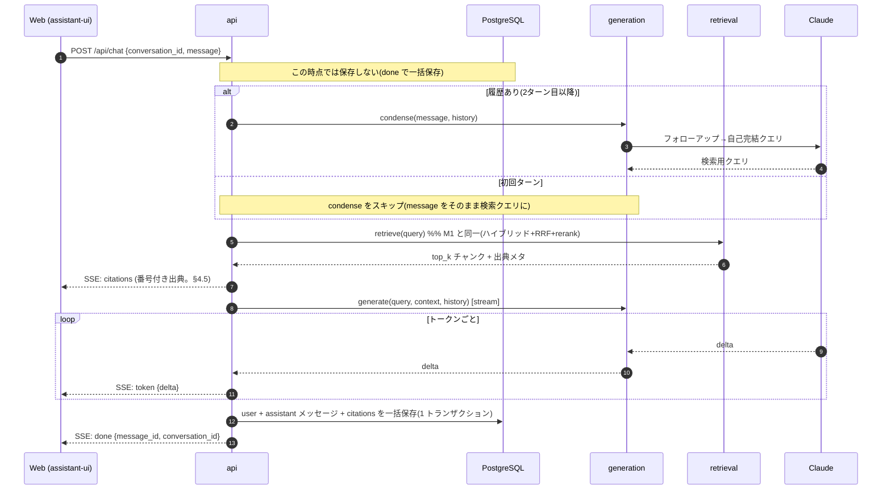

# Private RAG Apps — M2 フィーチャースペック: ストリーミング + 出典 UI + 会話履歴 (m2_streaming_and_history.md)

> 配置先: `docs/specs/m2_streaming_and_history.md`
> 対象マイルストーン: **M2**（requirements.md §10）
> 充足要件: **FR-4(完全)** / **FR-5** / **FR-6**、関連 **NFR-2 / NFR-4 / NFR-6 / NFR-7**
> 上位ドキュメント: 要件=`requirements.md`、構成=`architecture.md`、物理設計=`db_design.md`。
> **矛盾時の優先順位**（AGENTS.md 冒頭）: 本スペック > AGENTS.md > 一般慣習。本書が上位ドキュメントを更新・上書きする箇所は §12 に明記し、該当ドキュメントへの反映を必須とする（Definition of Success「設計文書が実装と一致」）。

---

## 1. 目的と背景

M0（Walking Skeleton: ベクトル検索のみ・非ストリーム）と M1（ハイブリッド検索 + リランク・非ストリーム）で **検索と生成の骨格は貫通済み**。ただし回答は同期 JSON で返っており、FR-4 の「ストリーミングで返す」・FR-5 の「マルチターン + 出典カード」・FR-6 の「会話の保存/一覧/再開」は未充足の**経過状態**にある（requirements.md §10 脚注）。

M2 のゴールは、この経過状態を解消し **「出典付きストリーミングチャット」をエンドユーザー体験として完成させる**こと。具体的には次の 3 本柱を実装する。

1. **ストリーミング（SSE）** — `/api/chat` を逐次トークン配信に切り替える（FR-4 完全化、TTFT を短縮 = NFR-2）
2. **出典 UI** — 回答本文の `[n]` と構造化 citations を対応させ、クリックで元ソースを表示する出典カードを描画（FR-5、NFR-6）
3. **会話履歴** — 会話の永続化・一覧・再開と、履歴を考慮したフォローアップのクエリ書き換え（condense）（FR-5, FR-6）

チャット UX（streaming / auto-scroll / retry / スレッド管理）は **assistant-ui のランタイムに委譲**し、自前実装しない（NFR-7 保守性、AGENTS.md §11 DO NOT）。

---

## 2. スコープ

### 2.1 In scope（M2 で実装する）

- `/api/chat` の **SSE 化**（`token` / `citations` / `done` / `error`）とキャンセル対応
- **マルチターン condense**（会話履歴を用いた自己完結クエリへの書き換え。指示語解決）
- **会話の永続化**（user / assistant メッセージ + citations を DB へ）
- **会話管理エンドポイント**（作成 / 一覧 / 詳細=履歴）
- **assistant-ui カスタムランタイム連携**（SSE→逐次描画、出典カード=generative UI、スレッド一覧/再開）
- ストリーミング生成を含む **Langfuse トレースの継続**（condense / generate span、TTFT 記録）

### 2.2 Out of scope（M2 では扱わない）

| 項目 | 送り先 | 理由 |
|---|---|---|
| Eval の拡充（30〜50問・生成指標・CI 連携） | **M3** | requirements §9 の段階導入。M2 は最小 Eval（M0）を回すのみ |
| 増分再取り込み・データ管理 UI・デモ仕上げ | **M4** | FR-1/FR-7/FR-8。M2 は会話系のみ |
| 会話の**リネーム / アーカイブ / 削除** UI | **M4 or 後続** | FR-6 は「保存/一覧/再開」まで。管理系は最小実装に含めない（§4.4 参照） |
| **生成中リロードでのストリーム再接続**（assistant-ui `resumeRun`） | **後続 or 対象外** | 自前 SSE を採用したため resumeRun は使えない。M2 は「リロードすると進行中の回答は失われる（そのターンは未保存＝再送で復旧）」を**非目標として許容**する（§4.2 の done 一括保存と整合） |
| マルチユーザー / ACL / SaaS コネクタ / エージェンティック RAG / PDF | **v1 スコープ外** | requirements §11 |
| ジョブキュー（Redis/ARQ 等）導入 | **なし** | AGENTS.md §11 DO NOT |

### 2.3 前提（M0/M1 で完成しているもの）

- CLI 取り込み（`make ingest` / `make demo`）と `sources` / `chunks` の投入
- ハイブリッド検索（pgvector + pg_bigm）→ RRF → Voyage rerank → `top_k = 8`（architecture §4, db_design §6）
- 非ストリームの `generate(query, context, history)` と引用付与ロジック（architecture §5）
- `core` のテレメトリ配線（Langfuse。1 リクエスト = 1 トレース。NFR-4）
- 最小 Eval（10問 + Recall@5、`make eval`）

> **依存方向は不変**（AGENTS.md §3）: M2 の追加も `api → generation → retrieval` の一方向を守る。LLM 呼び出し（condense 含む）は `generation` のみ、リランク/埋め込みは `retrieval` のみ。

---

## 3. 全体像（M2 で変わる Query Path）

M1 までとの差分は「**condense の常時適用**」「**生成が逐次配信になる**」「**会話の読み書き**」の 3 点。



> **エラー時**: 生成中の失敗は `SSE: error` を送出し、**そのターンは user / assistant とも保存しない**（§4.6）。これにより履歴は常に user↔assistant の整合した交互列に保たれ、リトライ時の user 行重複も起きない。クライアントは未送信状態として retry 導線を出す（失敗した質問文はクライアント側の composer に残す）。

---

## 4. バックエンド仕様

### 4.1 SSE 化した `/api/chat`

- レスポンスを `text/event-stream` に変更。FastAPI の `StreamingResponse`（または `sse-starlette` の `EventSourceResponse`）で実装し、**逐次フラッシュ**する。
- リバースプロキシのバッファリング無効化（`X-Accel-Buffering: no` 等）と、アイドルタイムアウト回避のための **keepalive コメント**（`: ping`）を送る。
- **クライアント切断 = キャンセル**: リクエストの `abortSignal`（assistant-ui が `run` に渡す）で接続が切れたら、進行中の LLM ストリームを中断し、部分結果を保存しない。
- リクエスト body: `{ conversation_id?: uuid, message: string }`。`conversation_id` 省略時はサーバ側で会話を遅延作成し、`done` イベントで返す（§4.4 の作成フローも参照）。
- **同時実行の前提**: 単一ユーザーだが 1 会話につきアクティブなストリームは 1 本を前提とする（2 タブ等で同一会話に同時送信した場合の整合は保証しない。M2 は割り切る）。

#### SSE イベント仕様（M2 確定版）

| event | data | 送出タイミング |
|---|---|---|
| `citations` | 番号付き出典配列（§4.5） | **retrieve/rerank 完了直後、最初の `token` の前**（★architecture §5/§7 からの変更。理由は §11） |
| `token` | `{ "delta": "…" }` | 生成トークンごと |
| `done` | `{ "message_id": uuid, "conversation_id": uuid }` | 生成正常終了時（★`conversation_id` を追加） |
| `error` | `{ "message": "…" }` | 生成/検索が回復不能に失敗したとき |

- SSE の `event:` フィールドで上記名を送り、`data:` は JSON 1 行とする。
- `citations` は **1 回のみ**送る（後述のとおり [n]→出典の対応は生成前に確定するため）。

### 4.2 会話の永続化（★done 一括保存）

**方針（決定）**: user / assistant メッセージは **`done` 時に 1 トランザクションで一括保存**する。リクエスト受信直後の user 先行保存はしない。

| タイミング | 操作 | 備考 |
|---|---|---|
| `done` 直前 | 同一トランザクションで `messages`(role='user') と `messages`(role='assistant', content, citations) を INSERT し、`conversations.updated_at` を更新 | **正常終了時のみ**。assistant の `message_id` を採番して `done` で返す |

- **なぜ done 一括か**: user を先行保存すると、生成失敗ターンで「回答のない user 行」が履歴に残り、次ターンの condense がその宙ぶらりんな発話を含む履歴を見てしまう。さらに retry で同一 user 行が重複挿入され履歴が壊れる。done 一括保存なら **履歴は常に user↔assistant の整合した交互列**に保たれる（NFR-6 の faithfulness にも寄与）。
- **失敗ターンは何も残さない**: エラー・キャンセル時は user / assistant いずれも INSERT しない。失敗した質問文はクライアントの composer に残して再送で復旧する（§2.2 の非目標と整合）。
- `messages.citations`（jsonb）には §4.5 の citations 配列をそのまま格納。
- **DDL 変更なし（この方針の帰結）**: done 一括保存にしたことで orphan 除外や `status` 列が不要になり、`conversations` / `messages`（0001_init で作成済み）をそのまま利用できる。マイグレーションは追加しない（db_design §4/§8 と整合）。
  - ※ もし将来「失敗した質問も履歴に残す」方針へ変える場合は、orphan を区別する `status` 列の追加（＝DDL 変更）と db_design の改訂が必要になる。M2 では採らない。

### 4.3 マルチターン condense（FR-5）

- **目的**: 「それの詳細は?」等の指示語・省略を、直近履歴で補完し**自己完結した検索クエリ**へ書き換える。
- **配置**: `generation` レイヤ（LLM 呼び出しのため。AGENTS.md §3）。プロンプトは `prompts/`（ハードコード禁止。AGENTS.md §6/§11）。
- **初回スキップ**: 履歴が無いターンは condense を呼ばず、`message` をそのまま検索クエリにする（コストと TTFT 削減）。
- **モデル**: 低コスト・低レイテンシのモデル（例: Claude Haiku 系）を設定で固定し、モデル名を記録（NFR-1 の再現性・NFR-5 のコスト可視化）。
- **入力の切り詰め**: 履歴はトークン予算内に収める（直近 N ターン。設定化）。
- **出力の扱い**: condense の出力は**検索クエリのみ**でユーザーには表示しない。生成プロンプトに渡す `history` は元の会話文（書き換え前）を使う。

### 4.4 会話管理エンドポイント

architecture §7 の一覧に沿いつつ、assistant-ui の `RemoteThreadListAdapter` に対応させるため **作成エンドポイントを 1 本追加**する。

| メソッド | パス | 用途 | assistant-ui 対応 |
|---|---|---|---|
| POST | `/api/conversations` | 空の会話を作成し `id` を返す | `RemoteThreadListAdapter.initialize()` |
| GET | `/api/conversations` | 会話一覧（id / title / updated_at）。updated_at 降順 | `RemoteThreadListAdapter.list()` |
| GET | `/api/conversations/{id}` | 会話詳細（messages を昇順で。role/content/citations 含む） | `ThreadHistoryAdapter`（再開時の履歴ロード） |
| POST | `/api/chat` | チャット（SSE）。§4.1 | `ChatModelAdapter.run()` |

- **会話の作成フロー（推奨）**: 新規スレッドは assistant-ui の `initialize()` → `POST /api/conversations` で先に会話を作り、以降の `/api/chat` は常に `conversation_id` を伴う。CLI/テスト経路のため `/api/chat` の遅延作成（conversation_id 省略）も残す。
- **タイトル**: M2 では **最初の user メッセージ先頭を切り詰めて `conversations.title` に設定**（LLM 呼び出しなし）。LLM ベースのタイトル生成は任意（`generateTitle` に後で差し替え可能）。
- **リネーム / アーカイブ / 削除**: FR-6（保存/一覧/再開）には含まれないため **M2 では実装しない**。`RemoteThreadListAdapter` は最小サーフェス（list / initialize / history）のみ実装する。

### 4.5 引用（citations）の番号付けとペイロード

- リランク後の `top_k` チャンクを **確定順で `[1..k]` に採番**（context 内の並び = citation 番号）。この対応は**生成前に確定**する。
- 生成プロンプトには `[n] 出典タイトル\n本文` 形式でコンテキストを列挙し、各主張に `[n]` を付すよう指示（architecture §5）。
- `citations` イベント/保存の構造（architecture §5 準拠）:

```json
{
  "citations": [
    {"n": 1, "title": "設計メモ", "path": "corpus/design.md", "heading": "検索設計", "chunk_id": "…"},
    {"n": 2, "title": "運用ノート", "path": "corpus/ops.md", "heading": "同期", "chunk_id": "…"}
  ]
}
```

- サーバは `top_k` 全件を番号付きで送る。**実際に本文へ出現した `[n]` だけを表示するフィルタはクライアント側**で行う（生成完了後に本文の `[n]` を走査。§5.3）。これにより「ストリーミング中でも `[n]` がクリック可能」かつ「最終表示は引用された出典のみ」を、サーバ往復なしで両立する。
- **★範囲外 `[n]` のガード（NFR-6）**: LLM が `top_k` に存在しない番号（例: `[9]`）を出力する可能性がある。**対応する citation エントリを持たない `[n]` は、リンク化・カード表示のいずれも行わず無視する**（存在しない出典を提示しない）。この判定はクライアントの表示フィルタで行い、サーバ側でもログ/トレースに「範囲外引用が出た」ことを記録できるとよい（プロンプト品質の観測）。
- 検索 0 件のときは生成せず「該当する情報が見つかりませんでした」を返し、`citations` は空配列（NFR-6、architecture §10）。

### 4.6 エラー処理・キャンセル・中断

| 事象 | 挙動 |
|---|---|
| 検索 0 件 | 生成せず定型文を `token` で 1 度返し、`citations: []` → `done`（保存はする／しないを設定で選択、既定は保存しない） |
| LLM 生成失敗 | 指数バックオフでリトライ（architecture §10）→ 最終失敗で `error` イベント。assistant メッセージ非保存 |
| condense 失敗 | フォールバックとして**元メッセージをそのまま検索クエリ**にして継続（検索自体は動かす） |
| クライアント切断 | LLM ストリームを中断・トレースを `cancelled` で閉じる・非保存 |
| 生成途中のトークン後に失敗 | `error` を送出。部分回答は保存しない（クライアントは retry） |

---

## 5. フロントエンド仕様（assistant-ui）

### 5.1 ランタイム構成

会話履歴（FR-6）まで含めるため、**スレッド一覧ランタイムでチャットランタイムをラップ**する。

```
useRemoteThreadListRuntime({
  runtimeHook: () => useLocalRuntime(chatModelAdapter),
  adapter: threadListAdapter,   // list / initialize / (generateTitle 任意)
})
```

- `chatModelAdapter`（`ChatModelAdapter`）: `async *run({ messages, abortSignal })` で `/api/chat` に POST し、SSE を読みながら**累積した `content` を都度 yield** する（§5.2）。
- `threadListAdapter`（`RemoteThreadListAdapter`）: §4.4 のエンドポイントに委譲（list / initialize）。
- 会話再開時の履歴ロードは `ThreadHistoryAdapter`（`/api/conversations/{id}`）で行う。
- これにより **branching / regenerate / auto-scroll / retry / スレッド切替**は assistant-ui の実装に委ねる（NFR-7、AGENTS.md §11）。Vercel AI SDK の DataStream protocol には**乗せない**（自前 SSE をカスタムランタイムで直接受ける。architecture §7）。

### 5.2 SSE → 累積 content マッピング（重要な落とし穴）

`ChatModelAdapter.run` はストリーミングの各ステップで **その時点の完全な `content` を yield** する契約。**チャンクごとに content 配列を作り直すと、先行して追加した出典パートが消える**（assistant-ui の既知の注意点）。よって累積状態はループの外に保持する。

| SSE event | ランタイム側の反映 |
|---|---|
| `citations` | 累積 content に**出典パート（or メッセージ metadata）を 1 度だけ追加**して保持し続ける |
| `token` | 累積テキストに `delta` を連結し、`content:[{type:'text', text: 累積}, …出典パート]` を yield |
| `done` | ストリーム終了。`message_id` / `conversation_id` を確定（会話 ID をスレッドに紐付け） |
| `error` | 例外化しエラー状態へ（assistant-ui の retry 導線が出る） |

> 実装メモ: 出典を「カスタムメッセージパート」で持つか「メッセージ metadata」で持つかは導入版 assistant-ui の API に合わせて確定する（どちらでも §5.3 の描画は可能）。**累積を毎回 yield する原則は共通**。

### 5.3 出典カード（generative UI）

- `citations` を専用の React コンポーネントで **出典カード**として描画（architecture §7 の generative UI 方針）。
- **クリックで元ソース情報（title / path / heading）を表示**（FR-5）。`chunk_id` を持つので将来は該当箇所ハイライト（requirements §11）に拡張可能。
- **表示フィルタ**: `done` 後に回答本文の `[n]` を走査し、**出現した番号のカードのみ**表示（§4.5）。ストリーミング中は全カードを保持しつつ `[n]` をリンク化しておき、確定時に間引く。
- **範囲外 `[n]` の無視**（§4.5 のガード）: citations に対応エントリの無い `[n]`（例: `top_k=8` なのに `[9]`）は、リンク化もカード表示もしない。プレーンテキストとして残すか除去するかは表示上の選択（既定: プレーンテキストのまま残す）。
- 回答本文中の（有効な）`[n]` は対応する出典カードへスクロール/ハイライトするアンカーにする。

### 5.4 スレッド一覧・再開（FR-6）

- 左ペイン等に会話一覧（`list()` → `/api/conversations`）。新規作成は `initialize()` → `POST /api/conversations`。
- 会話選択で `/api/conversations/{id}` から履歴を復元し、続きを送信できる（サーバは復元された履歴で condense を行う）。
- **リネーム/アーカイブ/削除の UI は M2 では出さない**（§2.2, §4.4）。

### 5.5 自前実装しないもの（NFR-7 / AGENTS.md §11）

streaming 表示・auto-scroll・retry・thread 管理・メッセージ編集/再生成は assistant-ui のコンポーネント/ランタイムに委譲する。これらを手書きしない。

---

## 6. 可観測性（NFR-4）

- **1 チャットリクエスト = 1 Langfuse トレース**を維持。M2 で span 構成は `condense`（初回はスキップ）→ `embed_query` → `retrieve`(vector/fts) → `rerank` → `generate`（**streaming**）。
- **ストリーミングでもトレース漏れを作らない**: 生成の span は最初のトークンで開始扱いにせず、呼び出し開始〜完了で閉じる。トークン数/コストは完了時に確定値を記録。
- `condense` の LLM 呼び出しもトークン数・コスト・レイテンシを記録（NFR-5 コスト可視化）。
- **TTFT を計測項目として記録**（§7）。トレース属性に `ttft_ms` を持たせ、Langfuse で分布を確認できるようにする。
- クライアント切断時はトレースを `cancelled` として閉じる。

---

## 7. パフォーマンス（NFR-2）

- **TTFT（初回トークンまで）の内訳**（フォローアップ時、すべて生成前に直列）:

  `TTFT ≈ t(condense) + t(embed_query) + t(vector+fts検索) + t(rerank) + t(初回トークン)`

- **主要レバー**:
  - 初回ターンは condense をスキップ（§4.3）
  - condense に低レイテンシモデルを使用し、指示語/履歴が無ければ**そもそも呼ばない**発見的スキップも検討
  - `hnsw.ef_search` と候補件数（`cand_k`）は検索レイテンシと再現率のトレードオフ（db_design §5/§6）。M2 では**計測して**調整
  - **投機的 retrieval**（緩和策・任意）: condense を待たず元メッセージで検索を先行実行し、condense 結果が変わらなければ流用、変われば再検索する。実装コストとのトレードオフのため M2 では候補どまり
- **目標値と現実性**: requirements §NFR-2 のとおり「実測後に確定」。ただし **condense（LLM 呼び出し）→ Voyage embed → 検索 → Voyage rerank → Claude 初回トークン が全て直列で TTFT に乗る**ため、フォローアップで condense をクリティカルパスに置く限り p95 < 2.0s は厳しめの見込み。M2 では Langfuse の `ttft_ms` / 検索レイテンシで **p95 のベースラインを取得**し、初回/フォローアップを分けて計測したうえで暫定目標をドキュメント化する（未達なら上記レバーの適用可否を §12 の反映と合わせて判断）。

---

## 8. データモデルへの影響

- **DDL 変更なし**。`conversations`（title / updated_at）と `messages`（role / content / citations / created_at）を利用（db_design §4）。
- 一覧は `updated_at DESC`、履歴は `messages(conversation_id, created_at)` の既存インデックスで取得（db_design §5）。
- タイトルは §4.4 のとおり最初の user メッセージから導出して `conversations.title` に保存。

---

## 9. 設定（core/config.py）

新規に外だしする値（ハードコード禁止。AGENTS.md §6）:

| キー(例) | 用途 | 既定(暫定) |
|---|---|---|
| `CONDENSE_MODEL` | condense 用の軽量モデル名 | Claude Haiku 系（記録必須） |
| `CONDENSE_HISTORY_TURNS` | condense に渡す直近ターン数 | 5 |
| `CHAT_HISTORY_TOKEN_BUDGET` | 生成プロンプトの履歴トークン上限 | 実測後確定 |
| `SSE_KEEPALIVE_SEC` | keepalive ping 間隔 | 15 |
| `TITLE_MAX_CHARS` | 会話タイトルの切り詰め長 | 40 |

既存の必須キー（`OPENAI_API_KEY` / `VOYAGE_API_KEY` / `LANGFUSE_*`(任意) / `DATABASE_URL` / `CORPUS_DIR`）は変更なし。

---

## 10. 受け入れ条件（Acceptance Criteria）

満たして初めて M2 完了とする（AGENTS.md §10 DoD に加えて）。

**ストリーミング（FR-4）**
- [x] `/api/chat` が `text/event-stream` を返し、`citations`→`token`(逐次)→`done` の順で配信される — `api/main.py` の `chat()` は `EventSourceResponse`（sse-starlette）で返却。`generation/generator.py:generate_answer_stream()` が citations を最初に yield（L57）してから token を逐次 yield、`api/main.py` の `event_generator()` が `done` を最後に yield（L236）。`tests/test_api.py::test_chat_bulk_save_and_history` が `event: citations`/`token`/`done` の出現順を検証
- [x] 生成失敗時は `error` イベントが送られ、**そのターンが user / assistant とも保存されない**（履歴の交互列が保たれる）— `api/main.py:192-201` で `has_error=True` を設定、L203 `if not has_error:` が Bulk Save をガード（DB保存自体をスキップ）。※専用の統合テスト（エラー発生ターンの非保存を直接検証するもの）は未整備（`m2_tasklist.md` Phase 2 参照）
- [x] クライアント切断で LLM ストリームが中断され、部分結果が保存されない — `api/main.py:171-173` `await request.is_disconnected()` でループを `break`、`has_error=True` として Bulk Save をスキップ。※OpenAI ストリーム自体の明示的な `close()`/キャンセル呼び出しはなく CPython の GC 経由の暗黙的な中断に依存しており、専用テストも無い（動作の弱点として `m2_tasklist.md` に注記）

**出典 UI（FR-5, NFR-6）**
- [x] 回答本文の `[n]` と出典カードが対応し、クリックで title / path / heading を表示できる — `frontend/src/components/Citations.tsx` が `title`/`heading` を `title` 属性に、`path` を `href` にレンダリング。`frontend/src/components/assistant-ui/thread.tsx:416` で `<Citations />` をメッセージ内に配線
- [x] 本文に出現しない番号の出典カードは最終表示に出ない — `Citations.tsx:31-46`（`isDone` 時のみ本文の `[n]` を走査し `validCitationIndices` でフィルタ）
- [x] **citations に対応しない範囲外 `[n]`（例: `top_k` 超の番号）はリンク化・カード化されない** — `Citations.tsx:37` `citations.find((c) => c.n === idx)` が対応エントリの無い番号を弾く
- [x] 検索 0 件で「該当する情報が見つかりませんでした」を返し、でっち上げない — `generation/generator.py:42-45`、`tests/test_chat.py::test_generate_answer_stream_no_chunks` で検証。※§4.6 が既定とする「保存しない」は未実装（実装は常に Bulk Save する。本項目文言＝でっち上げ防止自体は満たすが、乖離として `m2_tasklist.md` に注記）

**マルチターン（FR-5）**
- [x] 「それの詳細は?」等のフォローアップが直前話題を補完して検索される（condense が効く）— `generation/generator.py:condense()`、`tests/test_chat.py::test_condense_with_history`
- [x] 初回ターンでは condense を呼ばない — `api/main.py:153-156`（`existing_messages_count > 0` のときのみ condense）。`tests/test_api.py::test_chat_bulk_save_and_history` が `mock_condense.assert_not_called()`（1ターン目）/`assert_called_once()`（2ターン目）で検証

**会話履歴（FR-6）**
- [x] 会話が保存され、一覧に updated_at 降順で並ぶ — `api/main.py:96` `order_by(desc(Conversation.updated_at))`。保存は Bulk Save（L203-229）。`tests/test_api.py::test_conversations_crud`
- [x] 会話を選択して履歴を復元し、続きを送信できる — `frontend/src/lib/thread-adapter.ts` の `ThreadHistoryAdapter.load()`（`GET /api/conversations/{id}`）、`thread-adapter.test.ts` で検証

**assistant-ui / 保守性（NFR-7）**
- [x] streaming / auto-scroll / retry / スレッド切替を自前実装していない（assistant-ui に委譲）— `frontend/src/app/assistant.tsx` が `useRemoteThreadListRuntime`+`useLocalRuntime` で結線。`thread.tsx` は `ThreadPrimitive.ScrollToBottom`（auto-scroll）・`ActionBarPrimitive.Reload`（retry）・`BranchPickerPrimitive`（分岐）・`ComposerPrimitive` を使用しており独自実装は確認されず

**可観測性・性能（NFR-4, NFR-2）**
- [x] 1 チャット = 1 トレースで condense / generate(stream) が span 化され、トークン/コストが記録される — `api/main.py:122` `@observe()` on `chat()`、`generation/generator.py:8,39` `@observe(as_type="generation")` on `condense()`/`generate_answer_stream()`、両者とも `update_current_generation(usage_details=...)` でトークンを記録
- [ ] `ttft_ms` と検索レイテンシが記録され、p95 ベースラインがドキュメント化されている — `ttft_ms` の記録自体は実装済み（`api/main.py:180-184` `get_client().update_current_trace(metadata={"ttft_ms": ...})`）が、**p95 ベースラインのドキュメント化は未実施**。`requirements.md`/`docs/specs/m2_streaming_and_history.md` §7 とも「実測後に確定」という将来形の記述のみで実測値が無く、`m5_release_readiness.md` でも Langfuse トレースのスクショ取得は「未実行」の扱い（Docker/実行環境が必要。M5 Phase 3 待ち）

**共通（AGENTS.md §10）**
- [ ] `make lint` / `make test` が通る（新規ロジックにテストあり）— `make lint` は 2026-07-13 時点でクリーン（backend: ruff+mypy 0件、frontend: biome lint 警告2件・fmtは通過、exit code 0）。`make test` は DB 非依存のユニットテスト（45件、`tests/evals/` 含む）はすべて pass するが、DB 接続を要する統合テスト24件はこのセッションでは Postgres が起動しておらず `connection refused` で失敗（アサーション失敗ではない＝コード不備ではなくローカル実行環境の制約）。Docker 起動を伴う実行確認は M5 Phase 3 待ちのため保留
- [x] 依存方向ルール（§3）を破っていない — `retrieval/searcher.py` は `generation`/`ingestion` を import しない。`generation/generator.py` は `retrieval` を import しない。LLM 呼び出しは `generation/`（`openai` import）に限定
- [x] 本スペックが §12 の変更を `requirements.md` / `architecture.md` に反映済み — `architecture.md` v0.4（2026-07-08）が §3.2/§7 で citations 生成前送出・`done.conversation_id`・`POST /api/conversations`・累積 yield 注意・範囲外 `[n]` 無視を反映済み。`requirements.md` v0.4 が NFR-2 に初回/フォローアップ別計測を明記済み

---

## 11. テスト方針（AGENTS.md §8）

- **ユニット**: SSE イベント整形、`[n]` フィルタ（出現番号抽出）、**範囲外 `[n]` の無視**（citations に無い番号を除外）、condense のスキップ判定、タイトル切り詰め、履歴のトークン切り詰め。
- **統合**: `POST /api/conversations` → `POST /api/chat`(SSE) → `GET /api/conversations/{id}` を**テスト DB**（pgvector + pg_bigm）で通し、user/assistant/citations の永続化と復元を検証。
- **失敗ターン非保存**: 生成失敗・キャンセル時に user / assistant いずれも INSERT されず、履歴が user↔assistant の交互列を保つことを検証（重要。§4.2）。
- **LLM / Voyage はモック / 記録再生**（condense・generate・rerank・embed すべて実課金を叩かない）。ストリーミングはモックのトークン列で検証。
- **キャンセル**: abort で非保存・トレース `cancelled` を確認。
- **Eval への影響**: condense は新規プロンプト。AGENTS.md §7 に従い、**プロンプト追加時は `make eval` を実行**し単一ターン生成の回帰がないことを確認（マルチターン用 Eval セットは M3 スコープ。M2 では最小 Eval の非劣化を確認する位置づけ）。

---

## 12. 上位ドキュメントへの反映（本スペックによる変更点）

本書は次の点で `architecture.md` / `requirements.md` を更新する。**実装 PR で該当ドキュメントも合わせて改訂すること**（Definition of Success 準拠）。

1. **`architecture.md` §7 SSE**: `citations` の送出順を「token の後」→「**token の前（rerank 直後）**」に変更。`done` の payload に `conversation_id` を追加。
2. **`architecture.md` §7 API 表**: `POST /api/conversations`（会話作成 / assistant-ui `initialize` 対応）を追加。
3. **`architecture.md` §7 assistant-ui マッピング**: 出典パートは「累積 content に一度だけ追加して保持」する旨（§5.2 の落とし穴）を追記。
4. **`requirements.md` §NFR-2**: TTFT / 検索レイテンシの p95 目標を M2 実測で暫定確定した旨を追記。

> **未決事項**（実装着手前に確定する）
> - 出典を assistant-ui の「カスタムパート」で持つか「メッセージ metadata」で持つか（導入版 API 依存）。
> - 検索 0 件の定型応答を履歴に保存するか（既定: 保存しない）。
> - condense の発見的スキップ条件（指示語/参照語の有無など）をどこまで作り込むか。

---

## 13. 実装順序の目安 → 次アクション

AGENTS.md §12 に従い、**本スペック（`m2_streaming_and_history.md`）→ タスクリスト（`m2_tasklist.md`）→ 実装**の順で進める。実装は概ね次の依存順:

1. バックエンド: `/api/chat` の SSE 化（citations→token→done→error）＋キャンセル。**generate の streaming span を同時に配線**（後付け禁止。NFR-4 / AGENTS.md §7）
2. バックエンド: 会話の永続化（**done 一括保存**）+ `POST/GET /api/conversations`・`GET /api/conversations/{id}`
3. バックエンド: condense（初回スキップ・プロンプト外だし）。**condense span を同時に配線**
4. フロント: `useLocalRuntime`(ChatModelAdapter) で SSE 受信・累積 yield
5. フロント: 出典カード（generative UI・`[n]` フィルタ・**範囲外 `[n]` 無視**・クリック表示）
6. フロント: `useRemoteThreadListRuntime` + 履歴復元
7. 可観測性（横断）: `ttft_ms` 記録・cancelled 時のトレースクローズ・初回/フォローアップ別の p95 ベースライン記録（span 自体は 1・3 で配線済み）
8. 仕上げ: §10 受け入れ条件の充足確認、§12 の上位ドキュメント反映、最小 Eval 実行

> 次に作成すべき成果物は **`docs/specs/m2_tasklist.md`**（チェックボックスでの進捗管理。AGENTS.md §12）。

---

## 変更履歴

| version | 日付 | 変更 |
|---|---|---|
| v0.2 | 2026-07-07 | セルフレビュー反映: (1) 会話の永続化を **done 一括保存**に変更（user 先行保存を廃止。失敗ターンは非保存で履歴の交互列を維持。§3/§4.2）。(2) **範囲外 `[n]` の無視ガード**を追加（§4.5/§5.3、受け入れ条件・テストにも反映）。(3) 可観測性 span を各機能フェーズと同時配線する方針に明確化（§13）。(4) 生成中リロードでの再接続（resumeRun）を**非目標**として §2.2 に明記。(5) §4.1 に「1 会話 1 アクティブストリーム前提」を追加。(6) §7 に TTFT が直列で積み上がる現実性と投機的 retrieval の緩和策を追記 |
| v0.1 | 2026-07-07 | 初版。M2（SSE ストリーミング + 出典 UI + 会話履歴）のフィーチャースペック。SSE イベント確定、citations の生成前送出・クライアント側フィルタ、会話永続化と管理エンドポイント、condense 常時適用、assistant-ui カスタムランタイム連携（累積 yield の落とし穴・出典 generative UI・スレッド再開）、可観測性/TTFT、受け入れ条件を定義。上位ドキュメントへの反映点を §12 に明記 |