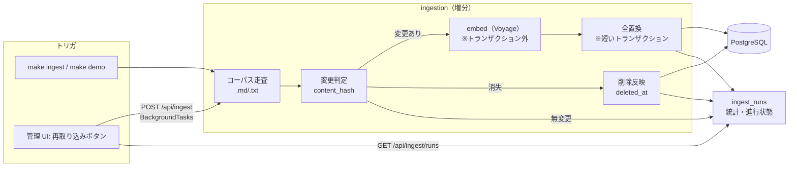

# Private RAG Apps — M4 フィーチャースペック: 増分再取り込み・データ管理 UI・デモモード仕上げ (m4_ingestion_and_demo.md)

> 配置先: `docs/specs/m4_ingestion_and_demo.md`
> 対象マイルストーン: **M4**（requirements.md §10）
> 充足要件: **FR-1 / FR-7 / FR-8 / FR-2（増分部分の完全化）**、**NFR-8（完全）**、関連 **NFR-3 / NFR-4 / NFR-7**
> 上位ドキュメント: 要件=`requirements.md`(v0.4)、構成=`architecture.md`(v0.4)、物理設計=`db_design.md`(v0.2)、規約=`AGENTS.md`(v0.7)。
> **矛盾時の優先順位**（AGENTS.md 冒頭）: 本スペック > AGENTS.md > 一般慣習。上位ドキュメントを更新する箇所は §13 に明記し、実装 PR で反映する。

---

## 1. 目的と背景

M0〜M3 で「取り込み → ハイブリッド検索 → ストリーミング生成 → Eval」が縦に貫通した。ただし取り込みは **初回フル取り込み**が中心で、運用フロー（**更新を安く反映する / UI から管理する / クリーン環境で 15 分で動かす**）が未完成。M4 はこの運用面を仕上げ、**レビュアーが自分の環境で気持ちよく触れる状態**にする。

M4 の 3 本柱:

1. **増分再取り込み（FR-2 の増分部分を完全化）** — `content_hash` による無変更スキップ・更新の全置換・削除反映・実行統計。埋め込みコストを抑える（NFR-5 にも寄与）
2. **コーパス管理 + データ管理 UI（FR-1 / FR-8）** — ソース一覧（チャンク数・最終取り込み日時）、UI からの再取り込みトリガ、インデックス初期化
3. **デモモード仕上げ + 再現性（FR-7 / NFR-8）** — `make demo` の 1 コマンド完結、seed コーパスの充実（Eval 兼用）、`docker compose up` からの 15 分クイックスタート

> FR-7・NFR-8 は requirements で★（レビュアー体験の核）。M4 は「見せる素材づくり」（M5）ではなく、**その素材が撮れる“実体”を完成させる**フェーズ。

---

## 2. スコープ

### 2.1 In scope

- 増分再取り込みロジック（変更判定・全置換・削除反映・スキップ記録・多重実行抑止）
- コーパス管理 API（`GET /api/sources` / `POST /api/ingest` / `GET /api/ingest/runs` / `DELETE /api/index`）の実装
- データ管理 UI（ソース一覧・再取り込み・初期化・進行状態表示）
- `make demo` の 1 コマンド完結と seed コーパスの仕上げ
- `docker-compose.yml`（**pgvector + pg_bigm 入り Postgres**）と 15 分クイックスタートの実測
- 取り込み実行の Langfuse トレース（埋め込みコスト可視化）

### 2.2 Out of scope

| 項目 | 送り先/理由 |
|---|---|
| README のデモ GIF・アーキテクチャ図・文書整備の最終仕上げ | **M5**（Definition of Success 素材）。M4 は quickstart 本文が書ける状態までを担保 |
| SaaS コネクタ / 増分同期カーソル / ジョブキュー（ARQ） | v1 スコープ外（requirements §11）。UI 再取り込みは BackgroundTasks で足りる |
| PDF/Office パース | v1 スコープ外。取り込みは `.md` / `.txt` のみ |
| ファイル監視（watch）による自動再取り込み | v1 では手動トリガ（CLI / UI）のみ |
| チャンキング戦略そのものの変更 | M4 では変えない（変えると M3 の Eval 回帰対象。§13 の相互依存参照） |

### 2.3 前提（M0〜M3 で完成しているもの）

- `ingestion` の基本（走査・正規化・チャンキング・埋め込み・upsert）と CLI（`make ingest` / `make demo` の骨格）
- `sources`（`content_hash` / `deleted_at` / `source_updated_at`）・`chunks`・`ingest_runs`（0001_init 済み。db_design §4）
- `retrieval` は `deleted_at IS NULL` 前提で読む（db_design §6）
- Langfuse 計装（未設定時 no-op。requirements v0.4 NFR-4）
- seed コーパスの初版（M3 の Eval ゴールデンデータセットが **path レベル正解**で依存。M3 §3.3/§3.4）

---

## 3. 全体像



---

## 4. 増分再取り込み（FR-2 の増分部分）

### 4.1 変更判定（content_hash）

- 各ファイルの**内容ハッシュ**（`content_hash`）を計算し、`sources.content_hash` と比較。
  - 一致 → **skip**（再チャンク・再埋め込みをしない＝コスト削減）。
  - 不一致 or 新規 → **更新対象**。
  - `source_updated_at`（mtime）は**補助**（ハッシュ計算前の早期スキップ判定に使ってもよいが、正は content_hash）。
- **★soft-delete 済み path の復活**: `sources.path` は UNIQUE（db_design §4）。一度消えて `deleted_at` が立った source と**同じ path** のファイルが戻った場合、新規 INSERT は一意制約違反になる。判定は path で既存行（削除済み含む）を引き当て、次のように分岐する:
  - 既存行が `deleted_at` 付きで content 無変更（hash 一致）→ **`deleted_at` を NULL に戻すだけ**（再埋め込みしない＝コスト節約。統計は `updated`/復活としてカウント）。
  - 既存行が `deleted_at` 付きで content 変更あり → **`deleted_at` を外し + 全置換**（§4.2）。
  - 生存行（`deleted_at IS NULL`）→ 通常の hash 判定（skip / 全置換）。
  - 完全な新規 path のみ INSERT。
- ハッシュはファイル内容から算出（正規化前の生バイト）。改行コード差などで無駄な再取り込みを避けたい場合は正規化後にハッシュする選択もあるが、**M4 では生バイトハッシュを既定**とし、方針を provenance コメントに残す。

### 4.2 更新の全置換（★埋め込みは事前・DB 反映は短いトランザクション）

更新対象 source は「**当該 source の chunks を全削除 → 再チャンク → 再挿入**」で置換する（部分更新しない。db_design §7 の決定）。ここで実装上の要点:

- **埋め込み（Voyage 呼び出し）はトランザクションの外で先に実行**する。埋め込みは外部 API で秒〜十数秒かかり、失敗もしうるため、**これを DB トランザクション内に置くと長時間ロック**になり、並行する検索クエリを阻害する。
- 埋め込みが全チャンク分そろってから、**「delete + insert」を 1 つの短いトランザクション**で実行する。これにより:
  - 検索が「チャンクが一瞬 0 件になった中間状態」を見ない（原子的に切り替わる）。
  - 埋め込み失敗時は DB を触らない（古い chunks が残り、検索は継続可能）。
- 失敗した source はスキップして次へ進み、`ingest_runs.stats.failed_files` に記録（architecture §10）。

### 4.3 削除反映と★安全弁

- コーパス走査で**見つからなくなった** source は `deleted_at` を立てる（論理削除）。検索は JOIN で除外（db_design §6）。
- **★安全弁（重要）**: コーパスディレクトリの設定ミス・マウント失敗・空ディレクトリ指定などで「全ファイルが消えた」ように見えると、**全 source が一括 soft delete される事故**が起きうる。これを防ぐため:
  - **分母は「生存 source 数」**（`deleted_at IS NULL`）とする。走査でヒットした path 数がこれに対して `INGEST_DELETE_GUARD_RATIO`（既定 0.5＝半減以上の減少）を下回る、または**走査 0 件**なら、**削除を適用せず実行を `error` で中断**し、理由を `ingest_runs.error` に残す（追加/更新は適用済みでも削除だけ止める、あるいは実行全体を error にするかは §14 未決だが、既定は**削除フェーズのみ中断**）。
  - **正当な大量削除のバイパス**: コーパス整理などで意図的に大量削除したい場合は `make ingest FORCE_DELETE=1`（API では明示フラグ）で安全弁を無効化できる。これが無いと大量削除のたびに中断して運用が詰まる。
  - **全消しは初期化を使う**: コーパス丸ごと消したい場合は増分ではなく `DELETE /api/index`（§5.3）を使う。増分取り込みの副作用で全消ししない。

### 4.4 多重実行の抑止（★running 行で担保・advisory lock は開始の原子性のみ）

**設計上の注意**: 取り込みは `POST /api/ingest` のレスポンス後に **BackgroundTasks で走る**（§5.2）。そのため「トランザクションスコープの advisory lock」だけでは排他できない — **開始トランザクションのコミット時点でロックが解放され、本処理中は無防備**になり 2 個目が入れてしまう。正しくは次の 2 段構成にする:

1. **実行中の担保 = `ingest_runs.status='running'` 行の存在**。本処理が走っている間はこの行が残り（完了時に `success`/`error` へ更新）、**新規リクエストは「running 行があれば即拒否」**（409 相当）。これが実行中ずっと効く排他の本体。
2. **開始の原子性 = 短い advisory lock**。「running 行の有無を確認 → 無ければ running 行を INSERT」を**同一トランザクション内で `pg_advisory_xact_lock` を取ってから実行**し、チェックと挿入の間の race（同時 2 リクエスト）を消す。ロックは開始トランザクションの範囲だけでよい（実行中の排他は 1 が担う）。

- **stale running の回収**: プロセスクラッシュ等で `running` 行が残ると以後の取り込みが永久に拒否される。`started_at` が一定時間より古く `finished_at IS NULL` の行は **stale とみなし、開始時に `error` へ回収**してから新規実行を許可する（しきい値 `INGEST_STALE_RUNNING_SEC`）。
- この方式は**スキーマ変更（DDL）不要**（部分ユニークインデックスは代替案だが DDL 追加になるため採らない。§10 参照）。

### 4.5 スキップと実行統計

- 対応形式外（`.md`/`.txt` 以外）・読込不能ファイルは**スキップし、理由をログ + `ingest_runs.stats` に記録**（FR-1 / architecture §6）。
- 1 実行 = 1 `ingest_runs` 行。`stats` に `{added, updated, deleted, skipped, failed_files:[...]}` を記録。`trigger`（`cli`/`api`/`demo`）と `status`（`running`/`success`/`error`）を持つ（db_design §4）。

---

## 5. コーパス管理 API とデータ管理 UI（FR-1 / FR-8）

### 5.1 `GET /api/sources`（ソース一覧）

- 返却: `path` / `title` / **チャンク数** / **最終取り込み日時**（`updated_at`）/ `deleted_at`。`deleted_at IS NULL` を既定、任意で削除済みも表示。
- チャンク数は `chunks` の集計。**ソースごとに count を回す N+1 を避け、`GROUP BY source_id` の 1 クエリで集計**して join する。

### 5.2 `POST /api/ingest`（再取り込み） + `GET /api/ingest/runs`（進行状態）

- `POST /api/ingest`: **FastAPI BackgroundTasks** で増分取り込みを起動し、作成した `ingest_run` の `id` を即返す（architecture §1）。ジョブキューは使わない。
- 多重起動は §4.4 に従い **`running` 行の存在で拒否**（開始の原子性のみ advisory lock）。実行中は 409 相当を返す。
- `GET /api/ingest/runs`: 実行履歴・進行状態（`status` / `stats` / `started_at` / `finished_at`）。**UI はこれをポーリングして進捗表示**（チャットの SSE とは別系統。取り込みは SSE 化しない）。
- **stats の逐次更新**: UI に進行中の件数（added/updated/skipped）を見せるため、走査ループ中に `ingest_runs.stats` を**定期的に UPDATE** する（完了時一括だと running 中に数字が動かない）。更新頻度はファイル数件ごと等（`INGEST_STATS_FLUSH_EVERY`）。

### 5.3 `DELETE /api/index`（インデックス初期化）

- **全 sources・全 chunks を削除**（コーパス側の初期化）。
- **スコープの明確化**: 初期化対象は**コーパス（sources/chunks）のみ**。**会話（conversations/messages）は消さない**（別関心事）。この線引きを spec で固定する。
- **取り込み中の初期化は拒否**: `running` の取り込みがある間は初期化を受け付けない（§4.4 の running チェックを初期化にも適用。§9 のエラー表参照）。
- 破壊的操作のため、UI では**確認ダイアログ**を必須にする。
- **監査記録（決定）**: 初期化は `ingest_runs` の `trigger` CHECK（`cli`/`api`/`demo`）に該当しないため、**`ingest_runs` には記録しない**。M4 では**アプリログに残すのみ**とし、専用の監査テーブルは作らない（DDL を増やさない。将来必要なら別テーブルを検討）。

### 5.4 データ管理 UI（Next.js）

- **ソース一覧画面**: path / title / チャンク数 / 最終取り込み日時。削除済みの表示トグル。
- **再取り込みボタン** → `POST /api/ingest` → `runs` をポーリングして進捗（running/ success/ error と stats）を表示。実行中はボタンを無効化（多重起動の UX 面の抑止。正の排他はサーバ §4.4）。
- **インデックス初期化ボタン** → 確認ダイアログ → `DELETE /api/index`。
- **assistant-ui はチャット用**。管理画面は素の Next.js（shadcn/ui）で作る（チャット UX の再実装禁止＝AGENTS §11 は管理画面には無関係）。

---

## 6. デモモード（FR-7 ★）

### 6.1 `make demo` フロー

`make demo` を **1 コマンドで「DB 準備 → マイグレーション → seed 取り込み → チャット可能」**まで到達させる:

```
make demo:  docker compose up -d db  →  make migrate  →  make ingest CORPUS=seed/（trigger='demo'）  →  （api/web 起動の案内）
```

- 実行後すぐ `make api` / `make web` でチャットできる状態。
- seed 取り込みは増分ロジックを通す（2 回目以降の `make demo` は無変更 skip で速い）。
- **★対象ディレクトリの切替**: `make demo` は **`CORPUS_DIR=seed/` として動く**（seed を取り込み対象にする）。実運用では各自が `.env` の `CORPUS_DIR` を自分の文書ディレクトリに差し替える。同一インデックス（sources）に seed と実コーパスが混在すると Eval 前提（M3）が崩れるため、**実文書を試すときは `DELETE /api/index` で初期化してから CORPUS_DIR を切り替える**運用を README に明記する。

### 6.2 seed コーパスの仕上げ（★M3 Eval と結合）

- **日本語を含む現実的な文書構成**（pg_bigm 日本語検索の実証も兼ねる。requirements FR-7）。
- **★M3 との相互依存**: seed は **Eval ゴールデンデータセットの根拠**（M3 §3.3 の `relevant` は seed の **path** を指す）。M4 で seed の**追加/リネーム/削除**を行うと M3 データセットの path が壊れる。
  - ルール: **seed 確定は M4 で行い、その後 M3 データセットの path 実在チェック（M3 §12 のスキーマ検証）を必ず通す**。seed の final 化と Eval データセットの整合を M4 の完了条件に含める（§11）。
- 実データ（個人文書）を混ぜない（NFR-3）。

### 6.3 README クイックスタート

- クイックスタートは**デモモード前提**で書く（requirements FR-7）。本文（コマンド列・前提キー・所要時間）を M4 で用意する。**GIF・図・文章の作り込みは M5**。

---

## 7. 再現性（NFR-8 ★）

### 7.1 `docker-compose.yml`（★pg_bigm 入り Postgres）

- **課題**: 標準の `pgvector/pgvector` イメージには **pg_bigm が含まれない**。`CREATE EXTENSION pg_bigm` を成功させるには、拡張がインストールされた Postgres イメージが必要。
- **対応**: **pgvector + pg_bigm を両方インストールした Postgres イメージ**を用意する（`Dockerfile` で pgvector ベースに pg_bigm をビルド/インストール、または postgres ベースに両方入れる）。`docker compose up` で拡張入り DB が上がることを保証。
- マイグレーション 0001 の `CREATE EXTENSION`（db_design §2）がクリーン起動で通ることを CI で確認（M3 の CI も同じ DB を使うため、この整備は Eval CI の安定にも効く）。

### 7.2 15 分クイックスタートの実測

- **クリーン環境**（キャッシュ無し）で `git clone → docker compose up → make demo` を実測し、**15 分以内**を確認（NFR-8）。イメージビルド時間（pg_bigm ビルド含む）が支配的になりやすいので、必要なら**ビルド済みイメージの publish** を検討（§14 未決）。
- 必要な外部アカウントは **Anthropic / Voyage のみ**（Langfuse 任意）。`.env.example` にキー項目と「Langfuse は任意」を明記。

### 7.3 Langfuse 任意（no-op）

- `LANGFUSE_*` 未設定でも `make demo` が完動する（requirements v0.4 NFR-4/NFR-8）。デモの 15 分計測は **Langfuse 無し**の素の状態でも成立させる。

---

## 8. 可観測性（NFR-4）

- 取り込み実行を **Langfuse トレース化**（source ごとの embed 呼び出し・トークン・コスト・レイテンシ）。増分により「今回実際に埋め込んだ分だけ」コストが出ることを可視化（skip の効果が見える）。
- `LANGFUSE_*` 未設定時は no-op。

---

## 9. エラー処理・フォールバック（architecture §10 準拠 + M4 追加）

| 事象 | 挙動 |
|---|---|
| 個別ファイルの読込/チャンク/埋め込み失敗 | スキップして続行、`ingest_runs.stats.failed_files` に記録 |
| 埋め込みバッチ失敗 | バッチ単位でリトライ、最終失敗は記録しスキップ（DB は触らない＝古い chunks 維持。§4.2） |
| 走査結果 0 件 / 大幅減少（生存比） | **削除フェーズを適用せず `error` 中断**（§4.3 安全弁）。`FORCE_DELETE` で明示バイパス可 |
| 多重起動 | **`running` 行の存在で拒否**（開始の原子性のみ advisory lock。§4.4） |
| stale な `running` 行（クラッシュ残骸） | 開始時に `error` へ回収してから新規実行を許可（§4.4） |
| soft-delete 済み path の復活 | `deleted_at` を外す（無変更なら再埋め込みなし／変更ありは全置換。§4.1） |
| 取り込み中のインデックス初期化 | `running` があれば初期化を拒否（§5.3） |
| 取り込み全体の失敗 | `ingest_runs.status='error'` + error 記録 |
| インデックス初期化 | 確認後に全 sources/chunks 削除。会話は保持（§5.3） |

---

## 10. データモデル・設定への影響

- **DDL 変更なし（維持）**: 増分・削除・実行ログはすべて 0001_init のカラム（`content_hash`/`deleted_at`/`source_updated_at`/`ingest_runs.*`）で賄える。多重実行抑止も **advisory lock で DDL 不要**（§4.4）。
  - ※ もし将来「実行中は 1 行だけ」を DB 制約で強制したくなったら、`ingest_runs` に `CREATE UNIQUE INDEX ... WHERE status='running'` の**部分ユニークインデックス**を足す選択肢がある（＝DDL 追加 + db_design 改訂）。M4 では採らない。
- 新規設定（`core/config.py`。ハードコード禁止）:

| キー(例) | 用途 | 既定(暫定) |
|---|---|---|
| `INGEST_DELETE_GUARD_RATIO` | 削除安全弁のしきい値（**生存 source** 比の減少率） | 0.5 |
| `INGEST_ADVISORY_LOCK_KEY` | 開始の原子性を守る advisory lock キー（実行中の排他は running 行） | 固定値 |
| `INGEST_STALE_RUNNING_SEC` | stale な `running` 行とみなす経過秒（クラッシュ回収） | 実測後確定 |
| `INGEST_STATS_FLUSH_EVERY` | 進捗の `stats` を UPDATE する間隔（ファイル数） | 実測後確定 |
| `INGEST_EMBED_BATCH_SIZE` | 埋め込みバッチサイズ | 実測後確定 |
| `CORPUS_DIR` | 取り込み対象ディレクトリ（既存。demo は `seed/`。§6.1） | — |

---

## 11. 受け入れ条件（Acceptance Criteria）

**増分再取り込み（FR-2）**
- [ ] 無変更ファイルは `content_hash` 一致で skip され、再埋め込みが発生しない
- [ ] 更新ファイルは chunks が全置換され、**埋め込みは事前・delete+insert は 1 トランザクション**で原子的に切り替わる（検索が中間状態を見ない）
- [ ] 消失ファイルは `deleted_at` が立ち、検索対象から外れる
- [ ] **soft-delete 済み path が復活**しても一意制約違反にならず、無変更なら再埋め込みせず `deleted_at` を外すだけになる（§4.1）
- [ ] **削除安全弁**: 生存 source 比で大幅減少/0 件のとき削除フェーズが中断し、`FORCE_DELETE` でバイパスできる（§4.3）
- [ ] **多重起動が `running` 行で拒否**され、実行中ずっと効く（開始の race は advisory lock で消える）。stale な running はクラッシュ後に回収される（§4.4）
- [ ] 対応形式外/失敗ファイルが skip され `ingest_runs.stats` に記録される

**管理 API / UI（FR-1 / FR-8）**
- [ ] `GET /api/sources` が path/title/チャンク数/最終取り込み日時を返す
- [ ] `POST /api/ingest` が BackgroundTasks で起動し run id を返す／`GET /api/ingest/runs` で進捗が見える
- [ ] `DELETE /api/index` が sources/chunks のみ削除し**会話は保持**する（確認導線あり）／**取り込み中は拒否**される
- [ ] 管理 UI でソース一覧・再取り込み（進捗表示）・初期化ができる

**デモ / 再現性（FR-7 / NFR-8）**
- [ ] `make demo` が 1 コマンドで「DB→migrate→seed 取り込み→チャット可能」まで到達する
- [ ] seed が日本語含む現実的構成で、**M3 Eval データセットの path 実在チェックが通る**
- [ ] `docker compose up` で **pgvector + pg_bigm 入り DB** が起動し `CREATE EXTENSION` が通る
- [ ] クリーン環境で `git clone → docker compose up → make demo` が **15 分以内**に成功する（実測）
- [ ] `LANGFUSE_*` 未設定でもデモが完動する

**共通（AGENTS.md §10）**
- [ ] `make lint` / `make test` が通る／依存方向（FS アクセスは `ingestion` のみ）を守る
- [ ] §13 の上位ドキュメント反映が済んでいる

---

## 12. テスト方針（AGENTS.md §8）

- **ユニット**: content_hash 判定（無変更/変更/新規）、削除安全弁のしきい値境界、スキップ分類（拡張子/読込失敗）、stats 集計。
- **統合**（テスト DB: pgvector + pg_bigm）:
  - 全置換の原子性（更新中に検索しても 0 件中間状態を返さない／埋め込み失敗時に古い chunks が残る）。
  - 削除反映後に `retrieval` が対象外化する。
  - **soft-delete 済み path の復活**（無変更＝再埋め込みなしで `deleted_at` 解除／変更＝全置換）。
  - **多重起動が `running` 行で拒否**され、実行中ずっと効く。**stale running のクラッシュ回収**で再実行できる。
  - **取り込み中の `DELETE /api/index` が拒否**される。
  - `DELETE /api/index` 後に会話が残る。
- **埋め込み/LLM はモック/記録再生**（実課金しない。AGENTS §8）。
- **デモ smoke**: seed 極小サブセットで `make demo` 相当（DB→migrate→ingest）が通る。
- **15 分計測は手動**（CI ではイメージビルドの計測のみ任意）。

---

## 13. 上位ドキュメントへの反映（本スペックによる変更点）

実装 PR で以下を反映（Definition of Success「文書と実装の一致」）:

1. **`db_design.md`**: 多重実行抑止を **`running` 行の存在 + 開始の原子性のための advisory lock**（DDL 不要）で行う旨と、**stale running の回収**を §4/§7 に注記（部分ユニークインデックスは将来の代替として併記）。削除安全弁（生存 source 比・`FORCE_DELETE` バイパス）と soft-delete 済み path の復活経路を §7 に追記。
2. **`architecture.md` §6/§10**: 増分取り込みの**埋め込み事前・短トランザクション全置換**と**削除安全弁**を明記。`DELETE /api/index` のスコープ（会話は保持）を §7 に注記。
3. **`architecture.md` §1 / `AGENTS.md` §4**: `docker-compose.yml` が **pg_bigm 入り Postgres イメージ**を要する旨を明記。
4. **`requirements.md` §9 / FR-7**: seed 確定（M4）と Eval データセット（M3）の**整合チェックを M4 完了条件に含める**相互依存を注記。

> **未決事項**（実装着手前に確定）
> - `content_hash` を生バイトにするか正規化後にするか（既定: 生バイト。§4.1）。
> - 安全弁発動時に**実行全体を error にするか、削除フェーズのみ中断して追加/更新は残すか**（既定: 削除フェーズのみ中断。§4.3）。
> - 15 分達成のため**ビルド済み DB イメージを publish** するか（ビルド時間が支配的な場合。§7.2）。
> - 削除安全弁のしきい値（0.5）と `INGEST_STALE_RUNNING_SEC` の妥当性（seed 規模・実測で調整）。
>
> （解決済み: `DELETE /api/index` の監査は「アプリログのみ・監査テーブルは作らない」に決定。§5.3）

---

## 14. 実装順序の目安 → 次アクション

AGENTS.md §12 に従い、**本スペック → `docs/specs/m4_tasklist.md` → 実装**の順で進める。概略の依存順:

1. `docker-compose.yml` + pg_bigm 入り Postgres イメージ（M3 CI の安定化にも効くので早めに）
2. 増分再取り込み（content_hash 判定 + **復活経路** → 埋め込み事前 → 短トランザクション全置換 → 削除反映 + 安全弁 → **running 行排他 + stale 回収** → stats 逐次記録）
3. 管理 API（`GET /api/sources` / `POST /api/ingest` / `GET /api/ingest/runs` / `DELETE /api/index`）
4. データ管理 UI（一覧・再取り込み進捗・初期化）
5. `make demo` の 1 コマンド化 + seed 仕上げ（→ **M3 データセットの path 整合チェック**）
6. 取り込みトレース（Langfuse・no-op 対応）
7. 15 分クイックスタート実測 + README quickstart 本文
8. 仕上げ: §11 受け入れ条件、§13 上位ドキュメント反映

> 次に作成すべき成果物は **`docs/specs/m4_tasklist.md`**（AGENTS.md §12）。

---

## 変更履歴

| version | 日付 | 変更 |
|---|---|---|
| v0.2 | 2026-07-08 | セルフレビュー反映: (1) **soft-delete 済み path の復活経路**を追加（一意制約違反回避・無変更なら再埋め込みなし。§4.1）。(2) 多重実行抑止を **`running` 行で担保・advisory lock は開始の原子性のみ**に修正（BackgroundTasks 実行中の排他漏れを解消）+ **stale running 回収**（§4.4）。(3) 削除安全弁の**分母=生存 source** 明記と **`FORCE_DELETE` バイパス**（§4.3）。(4) `make demo` の **`CORPUS_DIR=seed/` 切替**と実運用の差し替え手順（§6.1）。(5) minor: sources 集計の N+1 回避、`stats` 逐次更新、取り込み中の初期化拒否、初期化の監査はアプリログのみに決定（§5）。受け入れ条件・テスト・§9/§10/§13/§14 に波及反映 |
| v0.1 | 2026-07-08 | 初版。M4（増分再取り込み・データ管理 UI・デモ仕上げ）。増分の**埋め込み事前・短トランザクション全置換**、**削除安全弁**、**advisory lock による DDL 不要の多重実行抑止**、管理 API/UI、`make demo` 1 コマンド化、**pg_bigm 入り Postgres イメージ**、15 分クイックスタート実測、seed↔M3 データセットの整合、`DELETE /api/index` の会話非削除スコープを定義。上位ドキュメント反映点を §13 に明記 |