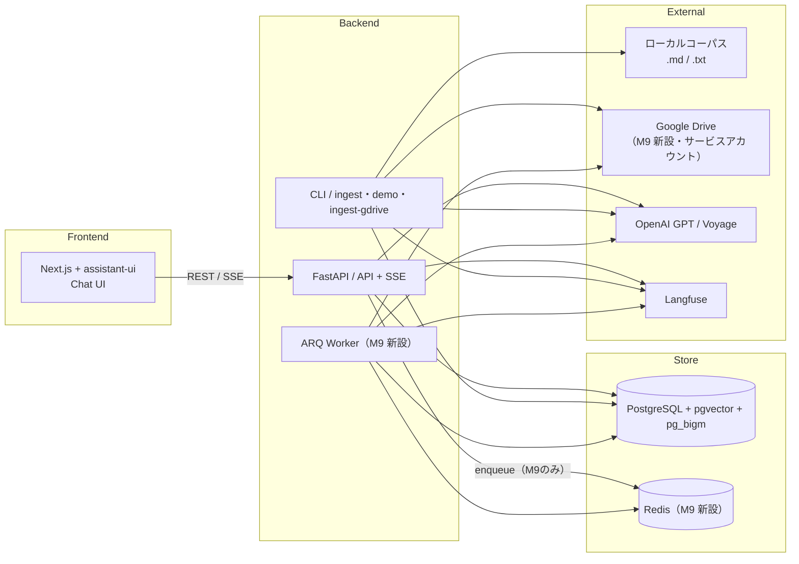

# M9: Google Drive フォルダ取り込み — 単一フォルダの再帰取り込みと出典連携

- Status: Accepted（T0-T8完了。M9クローズ条件は`m9_tasklist.md`末尾参照。手動スモークテスト（実GCPサービスアカウント + 実Driveフォルダ）のみユーザー環境依存のため持ち越し・再現手順はT8タスクノートに明記）
- Depends on: M4（増分再取り込みアーキテクチャ・`ingest_runs`、`m4_ingestion_and_demo.md`）、M2（SSE `citations` イベント — 本スペックはペイロード拡張のみ）
- Blocked by: なし
- Blocks: なし

> 本機能（Google Drive からのコーパス取り込み）は `requirements.md` §2/§11 では**除外項目としてのみ**記載されている。本スペックはその限定版（単一固定フォルダ・サービスアカウント認証・OAuth 不使用・ジョブキューは API 経由トリガのみ）を新たにスコープインするものであり、**本書がその一次ソース**である（M6/M7 と同じ位置づけ）。`requirements.md`・`AGENTS.md` への影響は §9 に明記し、本スペック確定と同時に反映済み。

---

## 改訂履歴

| version | 日付 | 変更 |
|---|---|---|
| v0.4 | 2026-07-17 | T8（テスト・ドキュメント最終反映・動作確認）完了に伴い Status を Draft → Accepted に変更。M9 全体（T0-T8）が完了し、`architecture.md`/`db_design.md`/README への実装反映、`decisions.md` の M9 関連3決定の実装照合（齟齬なし）、`make lint`/`make test` の通過を確認済み。実GCPサービスアカウント + 実Driveフォルダでの手動スモークテストのみユーザー環境依存のため持ち越し（再現手順は `m9_tasklist.md` T8タスクノート参照。M7 T3の Voyage/OpenAI レート制限ブロッカーと同様、環境依存の制約として明示的に記録） |
| v0.3 | 2026-07-17 | T7（エラー処理・観測性）実装反映: (1) §5 に `DRIVE_API_MAX_RETRIES`（既定5）を追加。Drive API の 429/5xx 対策は手製バックオフループではなく `google-api-python-client` 組み込みの `num_retries` に委譲する方針を明記 (2) §6 の ARQ ジョブ trace 名を、当初案の `ingest_run` 統一から実装済みの `ingest_run_gdrive`（T4 由来）へ確定。理由（Langfuse UI上でのトレース名によるローカル/Drive即時判別を優先）を追記し、実装と仕様の食い違いを解消 |
| v0.2 | 2026-07-17 | レビュー反映: (1) ARQ worker プロセスの起動方法が未規定だった問題を修正。§1/§4.8 に `make worker`（ローカルプロセス起動、`make web` と同じパターン）を追加 (2) 新設パッケージ `worker/` が AGENTS.md §3 の依存方向ルールに反映されていなかった問題を修正。§9 に AGENTS.md §3 への `worker/` 追加を記載（実ファイルは同時に改訂済み） |
| v0.1 | 2026-07-17 | 初版。ユーザーとの壁打ちで番号衝突（M8 は `m7_adaptive_routing.md` で clarify/HITL/LLM grader 候補として使用済み → 本機能は M9 とする）・スコープ改訂方針・認証方式（サービスアカウント）・ジョブキュー方針（ARQ/Redis を API 経由トリガの堅牢化目的でのみ導入）を確定 |

---

## 1. 背景と目的

自分のプライベート文書を Google Drive で管理しているユーザーが、ローカルにコピーする手間なく、特定の Drive フォルダをそのまま RAG のコーパスとして使えるようにする。

`requirements.md` §11「将来拡張」は Google Drive を Notion/Slack と並ぶ「SaaS コネクタ」として扱い、OAuth 認証・トークン管理・増分同期カーソル・接続管理・バックグラウンドジョブ(ARQ)を**セットで**導入する将来像を想定し、v1 スコープ外としていた（理由は `requirements.md` §1: 「単一ユーザー MVP に OAuth フロー（アプリ登録・コールバック・トークン更新）は過剰」「レビュアーが自分の SaaS アカウントなしですぐ動かせることを優先」）。

本スペックは、その将来像の**全部**ではなく、以下に限定した縮小版を扱う。

- 対象フォルダは**単一・固定**（複数フォルダ／複数 Drive アカウントの管理 UI は持たない）
- 認証は**サービスアカウント**（対象フォルダをサービスアカウントのメールアドレスに共有するだけで動作し、OAuth の同意画面・コールバック・トークンリフレッシュを一切実装しない）
- 増分取り込みは**既存の `content_hash` ベースの仕組みをそのまま再利用**（新規の同期カーソル概念を導入しない）
- ジョブキュー（ARQ/Redis）は導入するが、目的は**スケジューリングではなく API 経由トリガの堅牢化**（FastAPI プロセスの再起動をまたいだ再試行）に限定する。CLI 経由トリガは既存のローカル取り込みと同様、引き続き同期実行とする

この縮小により、`requirements.md` が OAuth を除外した本来の理由（単一ユーザー MVP への過剰なフロー）を実質的に回避しつつ、「特定の Drive フォルダ配下を丸ごと取り込む」というユーザーニーズを満たす。

### スコープ

**In scope (M9)**

- 単一の固定 Drive フォルダ配下を再帰的に走査し、コーパスとして取り込む
- 認証: サービスアカウント（`drive.readonly` スコープ、対象フォルダの共有のみで動作）
- 対応形式: プレーンテキスト (`text/plain`) ・Markdown 相当のファイル、および Google ドキュメント（`files.export` で `text/plain` へ変換）。それ以外（PDF・Google スプレッドシート/スライド・Office 文書・画像等）は**スキップしログに残す**（FR-1 の既存パターンを踏襲。PDF/Office パースは `requirements.md` §11 で引き続き明示的にスコープ外）
- 増分再取り込み: 既存の `content_hash` 比較（`ingestion/diff.py::classify()`）をそのまま再利用。Drive 固有の最適化として `modifiedTime` による事前フィルタ（変更が無ければダウンロードそのものを省略しコスト削減）を追加
- 削除反映: フォルダ配下から消えたファイルの論理削除（既存の削除安全弁 `INGEST_DELETE_GUARD_RATIO` をそのまま再利用）
- 出典（citation）: Drive file ID（`external_id`）と `webViewLink`（`source_url`）を `sources` に保存し、引用カードから元の Drive ドキュメントに直接アクセスできるようにする（ユーザー要望）
- トリガ: CLI（`make ingest-gdrive`、同期実行・既存パターン踏襲） + API（`POST /api/ingest/gdrive`、ARQ/Redis 経由のジョブ実行）。ARQ worker プロセスの起動用に `make worker` を新設する（§4.8）
- `requirements.md`・`AGENTS.md` のスコープ記述改訂（§9）

**Out of scope (M9 → 将来検討)**

- OAuth ベースの認証、複数フォルダ／複数 Drive アカウントの接続管理 UI
- Notion/Slack 等の他 SaaS コネクタ
- 定期自動同期（スケジューリング）。本スペックはオンデマンドトリガ（CLI/API 呼び出し）のみを扱う
- ACL 権限考慮検索（Drive 上の共有範囲を RAG 側の検索権限に反映する等）
- PDF / Office / スプレッドシート / スライドのパース
- 共有ドライブ（Shared Drives）固有の対応。通常の「マイドライブ」内フォルダを前提とする
- Drive ショートカット（shortcut）の解決。スキップ対象として扱う
- 回答の根拠ハイライト等、引用表示自体の高度化（M9 は citation にリンク情報を足すのみ）
- ローカル取り込み（CLI/API/BackgroundTasks）の実行方式変更。既存の挙動は一切変更しない

---

## 2. 用語定義（`requirements.md` §3 に対する追加分）

| 用語 | 定義 |
|---|---|
| Drive ソース | `source_type = 'google_drive'` の `sources` 行。取り込み元が Google Drive であることを示す |
| ローカルソース | `source_type = 'local_fs'` の `sources` 行（既存のローカルコーパス由来。デフォルト値） |
| `external_id` | Drive 上のファイル ID。Drive 内でリネーム・フォルダ移動されても不変。Drive ソースの一意性キー |
| サービスアカウント | Google Cloud のロボットアカウント。対象フォルダを明示的に共有することでのみアクセス可能になる。OAuth の同意フローを伴わない |
| ARQ | Redis を用いた非同期ジョブキューライブラリ（Python）。本スペックでは API 経由トリガの堅牢化にのみ用いる |

---

## 3. 設計原則

### 3.1 既存パイプラインの再利用を最大化する

`ingestion/indexer.py` のチャンキング・埋め込み・upsert 段（`chunk_markdown` / `_embed_documents` / `_insert_chunks` 相当）はソースの種類に依存しない実装になっている。M9 で新規に作るのは「Drive を探索し、ローカルの `Document` 相当のデータへ正規化する」ローダー層のみとし、後続段は変更しない。

### 3.2 identity key の一般化（後方互換を維持）

現在 `sources.path` は `UNIQUE` 制約を持つ唯一の識別キーである。しかし **Google Drive は同一フォルダ内でのファイル名重複を許容する**ため、Drive ソースを `path`（表示用の疑似パス）で一意識別することはできない。そこで `source_type` を導入し、識別キーをソース種別ごとに分離する（ローカル: `path` / Drive: `external_id`）。既存のローカル取り込みの挙動・DDL 上の実質的な制約は変更しない（パーシャルユニークインデックスによる後方互換。§4.2）。

### 3.3 ARQ は「API 経由トリガの堅牢化」のみに使う

CLI 経由トリガ（`make ingest-gdrive`）は既存のローカル取り込み CLI と同様、呼び出し元プロセス内で同期実行する。ARQ/Redis は **API 経由トリガ（`POST /api/ingest/gdrive`）にのみ**導入し、目的は「FastAPI プロセスの再起動をまたいだ再試行・状態非依存の実行」に限定する。**スケジューリング（定期自動同期）は行わない** — ユーザーとの合意事項。ローカル取り込みの API 経由トリガ（既存 `POST /api/ingest`）は引き続き `BackgroundTasks` のままとし、変更しない（両者で実行機構が異なることの根拠は §8 に記す）。

### 3.4 OAuth を使わない

サービスアカウント + 対象フォルダの明示的共有のみで完結させる。トークンリフレッシュ・同意画面・コールバック URL のロジックを一切持たない。

### 3.5 単一フォルダ限定

設定は環境変数 1 つ（`DRIVE_FOLDER_ID`）。複数フォルダ・複数コネクタの管理 UI は持たない（FR-8 データ管理 UI の対象は既存のソース一覧表示の拡張に留める。§4.7）。

---

## 4. アーキテクチャ

### 4.1 全体構成図



- `worker`（ARQ）は `POST /api/ingest/gdrive` からのジョブのみを処理する。ローカル取り込みの `BackgroundTasks` 経路は変更しない
- Redis はローカル docker-compose 上で起動する内部ミドルウェアであり、新たな SaaS アカウントを必要としない（NFR-8 に抵触しない。§5）

### 4.2 データモデル変更

`sources` テーブルにソース種別・外部 ID・アクセス URL を追加し、一意性制約をソース種別ごとに分離する。

```sql
ALTER TABLE sources
    ADD COLUMN source_type text NOT NULL DEFAULT 'local_fs'
        CHECK (source_type IN ('local_fs', 'google_drive')),
    ADD COLUMN external_id text,
    ADD COLUMN source_url  text;

-- 既存の UNIQUE(path) を分離する
ALTER TABLE sources DROP CONSTRAINT sources_path_key;

CREATE UNIQUE INDEX sources_path_unique_local
    ON sources (path) WHERE source_type = 'local_fs';
CREATE UNIQUE INDEX sources_external_id_unique_gdrive
    ON sources (external_id) WHERE source_type = 'google_drive';
```

- `path`: ローカルソースは既存通り相対パス（一意性あり）。Drive ソースは**表示用の疑似パス**（例: `ProjectDocs/設計/architecture.md` というフォルダ階層のパンくず）を格納するが、一意性は保証しない（Drive はフォルダ内のファイル名重複を許容するため）
- `external_id`: Drive ソースのみ non-null。Drive file ID。リネーム・フォルダ移動があっても不変であり、増分再取り込みの識別キーとして `path` より頑健
- `source_url`: Drive ソースのみ non-null。Drive API が返す `webViewLink`（例: `https://drive.google.com/file/d/<id>/view`）をそのまま保存。citation から直接開けるリンクとして利用（§4.6）
- `content_hash` / `source_updated_at` / `deleted_at` はソース種別に依らず既存のまま再利用（`content_hash` はダウンロードした本文の SHA256、`source_updated_at` は Drive の `modifiedTime` を格納）

`ingest_runs` には `source_type text NOT NULL DEFAULT 'local_fs' CHECK (source_type IN ('local_fs', 'google_drive'))` を追加する（既存の `trigger` CHECK制約 `IN ('cli','api','demo')` は変更しない。トリガ方法とソース種別は独立した軸のため分離する）。`GET /api/ingest/runs` / 将来のデータ管理 UI がソース種別で表示・フィルタできるようにする目的。

マイグレーションは `backend/alembic/versions/0004_drive_source_fields.py`（既存の連番・手書き SQL 方式を踏襲。`env.py` は autogenerate しない構成のため `models/rag.py` の `Source`/`IngestRun` と手動で同期させる）。

### 4.3 認証設計

- Google Cloud Console でサービスアカウントを作成し、JSON キーをダウンロード（リポジトリにはコミットしない。`.gitignore` 対象のローカルパスを環境変数で参照）
- スコープ: `https://www.googleapis.com/auth/drive.readonly`（読み取り専用。書き込み権限は不要）
- 対象 Drive フォルダを、サービスアカウントのメールアドレス（`xxx@yyy.iam.gserviceaccount.com`）に「閲覧者」として共有する（Google Drive 側での一度きりの手動操作。README に手順を記載）
- 設定: `DRIVE_SERVICE_ACCOUNT_FILE`（JSON キーファイルへのパス）・`DRIVE_FOLDER_ID`（対象フォルダの Drive ID。フォルダ URL 末尾の ID 部分）
- 認証情報は `core/config.py` の既存パターン（`pydantic-settings`、値のハードコード禁止）に従い追加する。Google 認証ライブラリにはファイルパスを明示的に渡す方式を取り、環境変数経由の暗黙的な認証（`GOOGLE_APPLICATION_CREDENTIALS` への依存）は避ける（設定の一元管理という既存方針に合わせるため）

### 4.4 Drive 探索・変更検知

1. `DRIVE_FOLDER_ID` を起点に `files.list`（クエリ: `'<folderId>' in parents and trashed = false`）で直下の子要素を取得し、`pageToken` でページネーションを処理する
2. 子要素が `mimeType = application/vnd.google-apps.folder` ならフォルダとして再帰する。`application/vnd.google-apps.shortcut`（ショートカット）はスキップしログに残す（Out of scope）
3. 対応 mimeType（`text/plain`・`text/markdown` 等のテキスト系、および `application/vnd.google-apps.document`）のみを取り込み対象とする。Drive はアップロード経路によって `.md`/`.txt` ファイルに `application/octet-stream` 等の曖昧な mimeType を付与することがあるため、mimeType 判定に加えてファイル名拡張子（`.md`/`.txt`）による救済判定も行う。それ以外はスキップし理由をログ・`ingest_runs.stats` に残す（FR-1 の既存パターン）
4. **変更検知の 2 段構え**（ローカル取り込みとの差分。理由は「Drive API 呼び出しにはコストがあるため、可能な限りダウンロードを避けたい」— ローカル FS 読み込みは高速なため、既存実装は常にハッシュを取り直している）:
   - まず Drive の `modifiedTime` を既存 `sources.source_updated_at` と比較する。変化が無ければダウンロードせずその場で `skip` 扱いとする
   - 変化がある、または新規ファイルの場合のみ本文を取得（プレーンファイルは `files.get(alt=media)`、Google ドキュメントは `files.export(mimeType=text/plain)`）し、SHA256 で `content_hash` を計算した上で、既存の `ingestion/diff.py::classify()` にそのまま渡して最終判定する（`content_hash` が変更検知の最終的な正とする点は既存ロジックを一切変えない）
5. 走査で見つかった `external_id` の集合と、DB 上の生存 Drive ソース（`source_type='google_drive' AND deleted_at IS NULL`）を突き合わせ、消えたものは論理削除する。削除安全弁（`INGEST_DELETE_GUARD_RATIO`）はソース種別ごとの生存数・ヒット数比率で判定する（ローカルとDriveの走査結果を混同しない）

### 4.5 ingestion pipeline への統合

- 新規: `ingestion/gdrive_client.py` — Drive API の薄いラッパー（`list_children(folder_id) -> list[DriveFile]` / `download_content(file) -> bytes` 相当）。テストではこのモジュールをまるごとモックする（既存の `voyageai` モック方式 `patch("private_rag_apps.ingestion.indexer.voyageai")` に倣う）
- 新規: `ingestion/gdrive_loader.py` — §4.4 の探索・変更検知ロジックを実装し、`loader.py::Document` 相当の内部表現（`source_type`/`external_id`/`source_url` を追加したもの）を生成する
- 変更: `ingestion/indexer.py` — `_process_one` の既存ソース照合ロジック（`Source.path == doc.path`）を `source_type` に応じて `path` 一致／`external_id` 一致に分岐させる。オーケストレーション関数は `execute_ingestion(directory)` に加えて `execute_gdrive_ingestion(folder_id)` を新設する（実体はローダーを差し替えるだけで、チャンキング以降は完全に共通コードを通す）
- CLI（`cli/main.py`）とジョブ関数（`worker/tasks.py`）は共に `execute_gdrive_ingestion()` を呼ぶ**同一の入口**を使う（ロジックの二重実装を避ける。§4.6）

### 4.6 ARQ ジョブ設計

- 新規パッケージ: `backend/src/private_rag_apps/worker/`（`settings.py`: ARQ `WorkerSettings` 定義 / `tasks.py`: ジョブ関数）
- ジョブ関数 `run_gdrive_ingestion(ctx) -> dict` は CLI と同じ `execute_gdrive_ingestion()` を呼ぶのみで、Drive 探索・チャンキング・埋め込み・upsert のロジックはジョブ関数側に持たせない（`cli` 層が「ingestion を呼ぶ薄い層」であるのと同じ位置づけを `worker` にも適用する）
- リトライ: ARQ の `max_tries`（新設定 `INGEST_GDRIVE_JOB_MAX_TRIES`、既定 3）。失敗時は最終試行後に `ingest_runs.status='error'` を記録する（既存のエラー記録パターンを踏襲）
- **`ingest_runs` がジョブ状態の一次情報源であり続ける**。ARQ 自体のジョブ結果ストレージ（Redis 上）は実行機構の内部状態に留め、`GET /api/ingest/runs` の応答は従来通り `ingest_runs` テーブルのみを参照する（API 契約を変更しない）
- 多重実行の抑止は既存の「`status='running'` 行の存在チェック + advisory lock」をソース種別に関わらず**グローバルに**維持する（ローカル取り込みと Drive 取り込みが同時に走らないようにする。並行実行を許可する複雑さを避けるための意図的な単純化。§10 未決事項に将来の見直し余地を記す）
- `POST /api/ingest/gdrive` はジョブを enqueue した時点で `ingest_runs` の `running` 行を**同期的に作成**してから応答する（既存 `POST /api/ingest` と同じパターン。ジョブが実際に処理を始める前から排他が効く）

### 4.7 引用（citation）への反映

出典チェーン（`retrieval/searcher.py::_format_chunks()` → `graph/state.py` の `ScoredChunk`/`Citation` → `generation/generator.py::generate_answer_stream()` → SSE `citations` → `api/main.py` 永続化 → `frontend/src/components/Citations.tsx` 描画）に `source_type`・`source_id`（Drive の `external_id`）を追加する。

- `graph/state.py`: `ScoredChunk`/`Citation` TypedDict に `source_type: str` `source_id: str | None` を追加
- `retrieval/searcher.py::_format_chunks()`: `Source` から `source_type`/`external_id`/`source_url` を取得しチャンク dict に含める
- `generation/generator.py::generate_answer_stream()`: citations 組み立てに `source_type`/`source_id` を追加
- `frontend/.../Citations.tsx`: 現状 `href={c.path ? \`file://${c.path}\` : "#"}` を、`source_type === "google_drive"` の場合は `c.source_url`（保存済みの `webViewLink`）を使うよう分岐する。既存の `file://` リンクは実際には同一マシン前提の簡易表示だが、Drive の場合は実際に開けるリンクになる点で UX が向上する

`GET /api/sources`（ソース一覧）にも `source_type`/`source_url` を含め、FR-8 のデータ管理 UI 上でローカル/Drive を区別できるようにする（既存 UI コンポーネントへの反映範囲はタスクリストで実装前に確認する）。

### 4.8 CLI / API コマンド設計

| 経路 | コマンド / エンドポイント | 実行方式 |
|---|---|---|
| CLI | `make ingest-gdrive` → `cli.main ingest-gdrive --trigger cli` | 同期実行（既存ローカル ingest と同じ） |
| API | `POST /api/ingest/gdrive` | `ingest_runs` の `running` 行を同期作成 → ARQ へ enqueue |
| API（進捗確認） | `GET /api/ingest/runs`（既存を再利用） | ソース種別に関わらず一覧表示 |
| Worker | `make worker` → `cd backend && uv run arq private_rag_apps.worker.settings.WorkerSettings` | ローカルプロセスとして起動（`make web` と同じパターン。専用の docker イメージは作らない） |

`make ingest-gdrive`（CLI経由）は呼び出しプロセス内で完結するため、**Redis・`make worker` の起動は不要**。Redis/worker は `POST /api/ingest/gdrive`（API経由）を使う場合にのみ必要になる。`make worker` は `api`（`docker compose up --build api`）とは異なり、`web`（`cd frontend && pnpm dev`）と同様にホスト上で直接プロセスを起動する方式とする（ARQ worker は Redis/DB/外部APIへの接続のみが必要でコンテナ化の恩恵が小さいこと、`docker-compose.yml` に専用サービスを追加する保守コストを避けることを理由に、ローカル起動をデフォルトとする）。`docker-compose.yml` には Redis サービスのみ追加し、worker 用サービスは追加しない。

既存 `AGENTS.md` の `make ingest CORPUS=path/` はドキュメント上の記載のみで実際には Makefile 変数として配線されていない（`CORPUS_DIR` は `.env` 経由）。M9 の新規ターゲットはこの不整合を踏襲せず、`DRIVE_FOLDER_ID` は `.env` 経由の設定のみとし、Makefile 変数展開には依存しない設計とする。

### 4.9 エラー処理

既存の `architecture.md` §10 エラー処理表に、以下を追加する（実装時に本表へ反映）。

| 事象 | 挙動 |
|---|---|
| Drive API レート制限（429） | 指数バックオフでリトライ（既存の埋め込み API 失敗時と同様の方針） |
| サービスアカウントの認証失敗 | 起動・実行開始時に早期検知し `ingest_runs.error` に明記（実行を開始しない） |
| 対象フォルダが見つからない／共有されていない | 同上。エラーメッセージにサービスアカウントのメールアドレスを含め、共有手順を案内する |
| 個別ファイルのダウンロード失敗 | 該当ファイルをスキップして続行、`ingest_runs.stats.failed_files` に記録（既存パターン） |
| ARQ ジョブが `INGEST_GDRIVE_JOB_MAX_TRIES` 回失敗 | `ingest_runs.status='error'` として記録し、それ以上の自動リトライはしない |

---

## 5. 設定とシークレット

`core/config.py` に以下を追加する（すべて既存の `pydantic-settings` パターンに従う。値のハードコード禁止）。

| 設定 | 既定値 | 用途 |
|---|---|---|
| `DRIVE_FOLDER_ID` | `""`（空 = Drive 機能無効） | 取り込み対象の Drive フォルダ ID |
| `DRIVE_SERVICE_ACCOUNT_FILE` | `""` | サービスアカウント JSON キーのファイルパス |
| `REDIS_URL` | `redis://localhost:6379/0` | ARQ が使用する Redis 接続文字列 |
| `INGEST_GDRIVE_JOB_MAX_TRIES` | `3` | API 経由トリガの ARQ ジョブ最大試行回数 |
| `DRIVE_API_MAX_RETRIES` | `5` | Drive API 呼び出し（`files.list`/`files.get`/`files.export`）失敗時の再試行回数。`google-api-python-client` の `HttpRequest.execute(num_retries=...)` 組み込みの指数バックオフに委譲する（`VOYAGE_MAX_RETRIES` と同じ方針。§4.9/§8 の 429 対策） |

- Drive 機能は**完全にオプトイン**。`DRIVE_FOLDER_ID`/`DRIVE_SERVICE_ACCOUNT_FILE` が空の場合、`make ingest-gdrive`/`POST /api/ingest/gdrive` は明確なエラーで即座に失敗するのみで、既存機能（`make demo` を含む）には一切影響しない
- Redis はローカル docker-compose 上で起動する内部ミドルウェアであり、新たな SaaS アカウント登録を必要としない。NFR-8「必要な外部アカウントは OpenAI / Voyage の API キーのみ」は Drive 機能を使わない限り引き続き成立する。Drive 機能自体は Google アカウント（サービスアカウント作成のための GCP プロジェクト）を新たに要求するが、これは機能を使う場合にのみ必要なオプトイン要件であり、`make demo` のクリーンルーム体験（NFR-8）には影響しない
- `docker-compose.yml` に `redis`（`redis:7-alpine` 等の軽量イメージ）を追加する
- `backend/.env.example` に `# Google Drive設定（M9・任意）` セクションを追加する

---

## 6. 可観測性（Langfuse）

- Drive 取り込みの埋め込み呼び出しは既存の `@observe(name="embed_documents")` にそのまま乗る（ローダーが差し替わるだけで埋め込み呼び出し自体は共通コード）
- Drive 探索段（`gdrive_loader.load_drive()`）に `@observe(name="gdrive_scan")` span を追加し、走査件数（`files_scanned`/`documents_found`/`skipped`/`failed`）・API 呼び出し回数（`list_calls`/`download_calls`）を span メタデータに記録する（Drive API のレート制限診断に資する。T7 で実装）
- ARQ ジョブの実行自体（`execute_gdrive_ingestion()`）は、ローカル取り込みと同じ `@observe(name="ingest_run")` ではなく、**専用の `@observe(name="ingest_run_gdrive")`** で trace 化する（T4 で導入・T7 で確定。当初案は本節旧版の通り `ingest_run` への統一だったが、Langfuse UI 上でトレース名だけを見てローカル/Drive 取り込みを即座に区別できる利点を優先し、意図的に分離する判断へ変更した。両者とも `ingest_runs` テーブルへは同一スキーマで記録されるため、DB側のクエリ性はこの判断で変わらない）

---

## 7. Eval・既存機能への影響

- チャンキング・埋め込みモデル・プロンプトは一切変更しないため、`make eval` / `make eval-routing` の結果には影響しない（AGENTS.md §7 の「埋め込み/プロンプト変更時は Eval 必須」ルールの対象外）
- シードコーパス（`seed/corpus`）・ゴールデンデータセットは引き続きローカルのみで構成し、Drive ソースを混在させない（`make demo` の再現性を優先する既存方針を維持。AGENTS.md §4）
- 新規追加コード（`gdrive_client.py` / `gdrive_loader.py` / `worker/`）に対応するユニットテストを新設する（AGENTS.md §8: 外部 API 呼び出しはモック。Drive API 呼び出しも実課金対象ではないが、既存方針に倣いテストでは実 API を叩かない）

---

## 8. 依存関係とリスク

| リスク | 内容 | 対策 |
|---|---|---|
| Drive API レート制限 | 大量ファイルの再帰走査で 429 が発生しうる | 指数バックオフ、既存の埋め込み API ペーシング（`INGEST_EMBED_MIN_INTERVAL_SEC`）と同様の思想を Drive 呼び出しにも適用 |
| サービスアカウント設定の複雑さ | GCP プロジェクト作成・サービスアカウント作成・フォルダ共有という複数手順がユーザー側に発生する | README にステップバイステップの手順を追加（タスクリストに含める） |
| Redis という新規インフラ依存 | ローカル環境の複雑さが増す | docker-compose に統合し `docker compose up` だけで起動する構成にする。Drive 機能を使わない場合は Redis が起動していても実質無風 |
| `sources.path` の UNIQUE 制約変更 | 既存データへの影響 | パーシャルユニークインデックスで完全後方互換（ローカルソースの一意性制約は実質的に変わらない）。マイグレーションはロールバック手順を明記する |
| ARQ とローカル取り込み(BackgroundTasks)の実行機構混在 | アーキテクチャの一貫性という観点では複雑さが増す | §3.3 の通り、Drive の API 経由トリガのみに限定する理由（外部 API 呼び出しを伴う処理はプロセス再起動への耐性の価値が高い）を明記し、無秩序な拡大を防ぐ |
| 削除安全弁のソース種別分離漏れ | ローカルとDriveの走査結果を混同すると誤削除の恐れ | §4.4 の通り安全弁判定をソース種別ごとに独立させる。テストで明示的に検証する |

---

## 9. `requirements.md` / `AGENTS.md` への影響（反映済み）

本スペック確定と同時に、以下の改訂を反映済み（差分の詳細は各ファイルの変更履歴を参照）。

**`requirements.md`**
- §2「Out of scope (v1)」: 「SaaS コネクタ（Notion / Slack / **Google Drive**）」から Google Drive を除外し、限定版が M9 でスコープインされた旨を注記
- §11「将来拡張」: 同様に Google Drive を SaaS コネクタの箇条書きから外し、「Google Drive の限定的な取り込み（単一固定フォルダ・サービスアカウント認証・API 経由トリガのみ ARQ/Redis 併用）は M9 でスコープイン済み」を追記。Notion/Slack・複数フォルダ管理・OAuth ベース認可は引き続き将来拡張として残す
- ヘッダのバージョン表記（`v0.5`）を変更履歴の最新版と一致させ `v0.7` に修正（既存の記載不整合の是正）

**`AGENTS.md`**
- §1: 「SaaS コネクタ（Notion/Slack/Drive）・OAuth・マルチユーザー・ACL は v1 スコープ外」に、Google Drive の限定的取り込み（M9）が例外である旨を注記
- §2 技術スタック: 「ジョブキューは無い」に M9 の ARQ/Redis 例外を注記（レビューで発見した内部矛盾の是正）
- §3 ディレクトリ構成・依存方向のルール: 「Google Drive API へのアクセスは `ingestion/` のみ」を、ローカル FS アクセスのルールに準じて追加。加えて新設パッケージ `worker/`（ARQ ジョブ関数）をディレクトリ構成に追加し、`worker` は `cli` と同様 `ingestion` を呼ぶ薄い層である旨を依存方向ルールに明記（M7 の `graph` 新設時と同じ改訂パターン。レビューで判明した抜け漏れの是正）
- §11 DO NOT: ジョブキュー導入禁止の項目に、M9 の API 経由トリガに限定した例外を注記。スコープ外項目（SaaS コネクタ / OAuth / ...）の参照先である `requirements.md` §11 側で Google Drive が例外化されるため、本項目は変更しないが実質的に Google Drive はこの禁止列挙の対象から外れる

`architecture.md`・`db_design.md` への反映は本スペックでは行わない。既存の M4/M7 と同様、実装 PR の中で実装内容を反映する（本スペック §4 が実装までの間の設計の一次ソースとなる）。

---

## 10. タスク分割（概要）

詳細は `docs/specs/m9_tasklist.md` を参照。概要:

1. データモデル拡張（マイグレーション・`models/rag.py`）
2. Drive 認証・クライアント層
3. Drive 探索・ローダー実装
4. indexer 統合・CLI コマンド
5. ARQ/Redis ジョブ基盤・API エンドポイント
6. citation 連携（バックエンド + フロントエンド）
7. エラー処理・観測性
8. テスト
9. ドキュメント最終反映（README・`decisions.md`）・動作確認

---

## 11. 未決事項

- **共有ドライブ（Shared Drives）対応**: 現状「マイドライブ」内フォルダのみを前提とする。ユーザーの実際の利用形態が共有ドライブの場合は再検討が必要（`supportsAllDrives`/`includeItemsFromAllDrives` パラメータの追加で対応可能と見込むが未検証）
- **定期自動同期の要否**: 今回は明示的にスコープ外としたが、実運用で「取り込み忘れ」が問題になった場合、ARQ の cron ジョブ機能を使えば追加コストは小さい。要否は運用してから再検討する
- **複数フォルダ対応の要否**: 現状は単一フォルダのみ。複数フォルダが必要になった場合、`DRIVE_FOLDER_ID` を単一値からリストへ拡張する変更が必要（`sources` 側のスキーマ変更は不要と見込む）
- **ローカル取り込みと Drive 取り込みの同時実行制限**: §4.6 の通りグローバル排他としたが、両者が独立したリソース（ローカル FS vs Drive API）にアクセスする以上、将来的にソース種別ごとの排他に緩和する余地がある。優先度は低い
